---
tags:
  - c++
  - qt
  - design-patterns
  - software-engineering
created: 2026-07-01
aliases:
  - GoF Design Patterns
  - C++ 设计模式
  - Qt 设计模式
---

# 设计模式完全指南（C++ / Qt）

## 概述

设计模式（Design Patterns）是软件工程中针对反复出现的问题的通用、可复用解决方案。1994 年 GoF（Gang of Four）在《Design Patterns: Elements of Reusable Object-Oriented Software》中系统归纳了 23 种经典模式，分为三大类：**创建型**、**结构型**、**行为型**。

本文以 C++ 为实现语言，重点结合 **Qt 框架**中的实际应用——Qt 本身就是设计模式的最佳教学案例，其源码中大量运用了经典模式。

> [!note] 学习建议
> 不必一次性背下所有模式。先理解每个模式的**意图**（它解决什么问题），然后在你自己的代码中"遇到类似痛点时"再回头查阅具体实现。模式是工具箱，不是教条。

## 1. 设计原则：SOLID

在学模式之前，先理解 SOLID 五大设计原则——设计模式本质上是对这些原则的具体化应用。

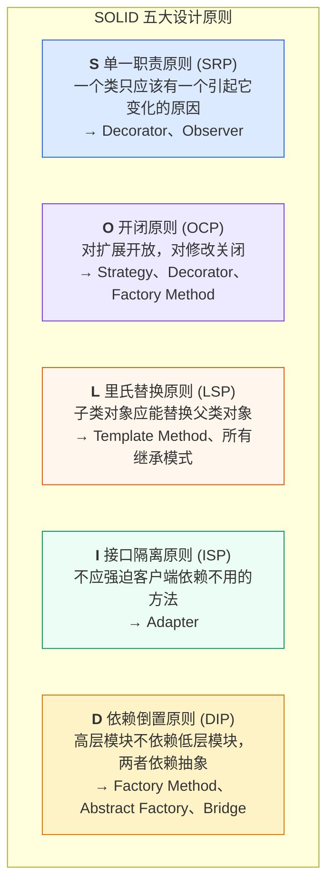
```mermaid
flowchart TD
    subgraph SOLID["SOLID 五大设计原则"]
        S["<b>S</b> 单一职责原则 (SRP)<br>一个类只应该有一个引起它变化的原因<br>→ Decorator、Observer"]
        O["<b>O</b> 开闭原则 (OCP)<br>对扩展开放，对修改关闭<br>→ Strategy、Decorator、Factory Method"]
        L["<b>L</b> 里氏替换原则 (LSP)<br>子类对象应能替换父类对象<br>→ Template Method、所有继承模式"]
        I["<b>I</b> 接口隔离原则 (ISP)<br>不应强迫客户端依赖不用的方法<br>→ Adapter"]
        D["<b>D</b> 依赖倒置原则 (DIP)<br>高层模块不依赖低层模块，两者依赖抽象<br>→ Factory Method、Abstract Factory、Bridge"]
    end
    style S fill:#dbeafe,stroke:#2563eb
    style O fill:#ede9fe,stroke:#7c3aed
    style L fill:#fff7ed,stroke:#ea580c
    style I fill:#ecfdf5,stroke:#059669
    style D fill:#fef3c7,stroke:#d97706
```

### 1.1 C++ 中的 SOLID 示例

```cpp
// 违反 DIP：高层直接依赖低层
class MySQLDatabase {
public:
    void insert(const QString& data) { /* ... */ }
};

class UserService {
    MySQLDatabase db;  // ❌ 依赖具体类，无法切换到 PostgreSQL
public:
    void saveUser(const QString& user) { db.insert(user); }
};

// 遵循 DIP：依赖抽象接口
class IDatabase {
public:
    virtual ~IDatabase() = default;
    virtual void insert(const QString& data) = 0;
};

class MySQLDatabase : public IDatabase { /* ... */ };
class PostgresDatabase : public IDatabase { /* ... */ };

class UserService {
    IDatabase& db;  // ✅ 依赖抽象，可注入任意实现
public:
    UserService(IDatabase& db) : db(db) {}
    void saveUser(const QString& user) { db.insert(user); }
};
```

## 2. 模式分类总览

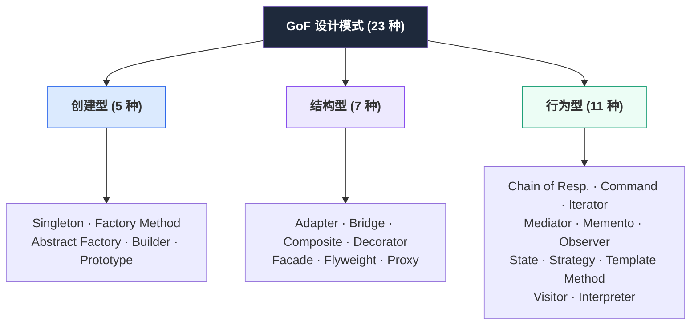
```mermaid
flowchart TD
    GOF["<b>GoF 设计模式 (23 种)</b>"] --> CREATIONAL["<b>创建型 (5 种)</b>"]
    GOF --> STRUCTURAL["<b>结构型 (7 种)</b>"]
    GOF --> BEHAVIORAL["<b>行为型 (11 种)</b>"]

    CREATIONAL --> C1["Singleton · Factory Method<br>Abstract Factory · Builder · Prototype"]
    STRUCTURAL --> S1["Adapter · Bridge · Composite · Decorator<br>Facade · Flyweight · Proxy"]
    BEHAVIORAL --> B1["Chain of Resp. · Command · Iterator<br>Mediator · Memento · Observer<br>State · Strategy · Template Method<br>Visitor · Interpreter"]

    style GOF fill:#1e293b,color:#fff
    style CREATIONAL fill:#dbeafe,stroke:#2563eb
    style STRUCTURAL fill:#ede9fe,stroke:#7c3aed
    style BEHAVIORAL fill:#ecfdf5,stroke:#059669
```

## 3. 创建型模式（Creational Patterns）

创建型模式抽象了对象的实例化过程，使系统独立于其对象的创建、组合和表示方式。

### 3.1 Singleton（单例）

> **意图**：确保一个类只有一个实例，并提供全局访问点。

#### 问题场景

多个组件需要共享同一个配置对象、日志器或数据库连接池。如果每个组件各自创建，会导致状态不一致或资源浪费。

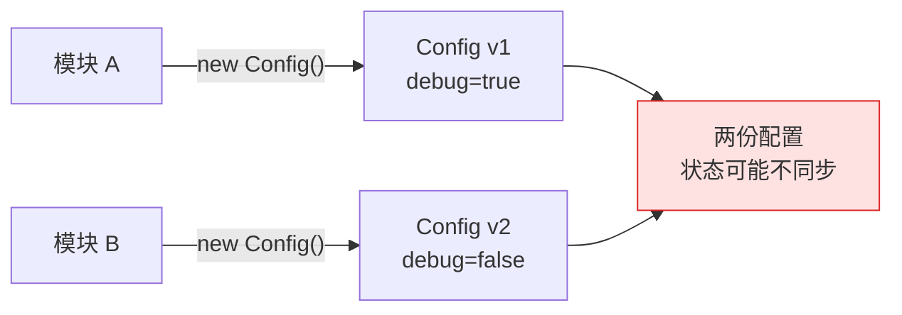
```mermaid
flowchart LR
    A["模块 A"] -->|"new Config()"| C1["Config v1<br>debug=true"]
    B["模块 B"] -->|"new Config()"| C2["Config v2<br>debug=false"]
    C1 --> PROBLEM["两份配置<br>状态可能不同步"]
    C2 --> PROBLEM
    style PROBLEM fill:#fee2e2,stroke:#dc2626
```

#### 结构

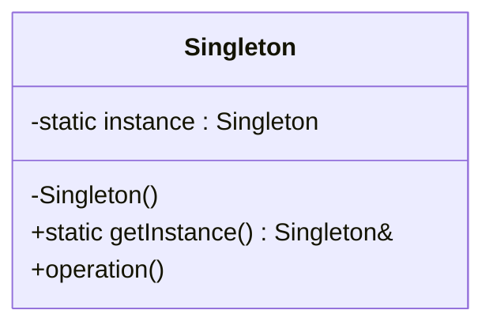
```mermaid
classDiagram
    class Singleton {
        -static instance : Singleton
        -Singleton()
        +static getInstance() Singleton&
        +operation()
    }
```

#### C++ 实现（线程安全 Meyers Singleton）

```cpp
class ConfigManager {
public:
    // C++11 保证静态局部变量初始化的线程安全
    static ConfigManager& getInstance() {
        static ConfigManager instance;
        return instance;
    }

    ConfigManager(const ConfigManager&) = delete;
    ConfigManager& operator=(const ConfigManager&) = delete;

    void setDebugMode(bool enabled) { m_debug = enabled; }
    bool isDebugMode() const { return m_debug; }

private:
    ConfigManager() = default;  // 构造函数私有
    bool m_debug = false;
};

// 使用
ConfigManager::getInstance().setDebugMode(true);
```

#### Qt 中的单例

```cpp
// QApplication 本质上是单例（每个进程只有一个）
QApplication app(argc, argv);

// QSettings 通常作为单例使用
class AppSettings {
public:
    static AppSettings& instance() {
        static AppSettings s;
        return s;
    }

    QVariant value(const QString& key) const {
        return m_settings.value(key);
    }

private:
    AppSettings() : m_settings("MyCompany", "MyApp") {}
    QSettings m_settings;
};
```

> [!warning] 慎用单例
> 单例本质上是**全局状态**，会让单元测试变得困难（测试之间状态互相污染）。Qt 项目中，优先考虑用依赖注入代替单例。仅在真正需要"有且仅有一个实例"的场景使用（如日志系统、硬件设备句柄）。

### 3.2 Factory Method（工厂方法）

> **意图**：定义一个用于创建对象的接口，让子类决定实例化哪个类。

#### 问题场景

一个文档编辑器需要支持多种文件格式。`openDocument()` 的逻辑是通用的（读文件、解析、渲染），但创建具体解析器的类型取决于文件扩展名。

#### 结构

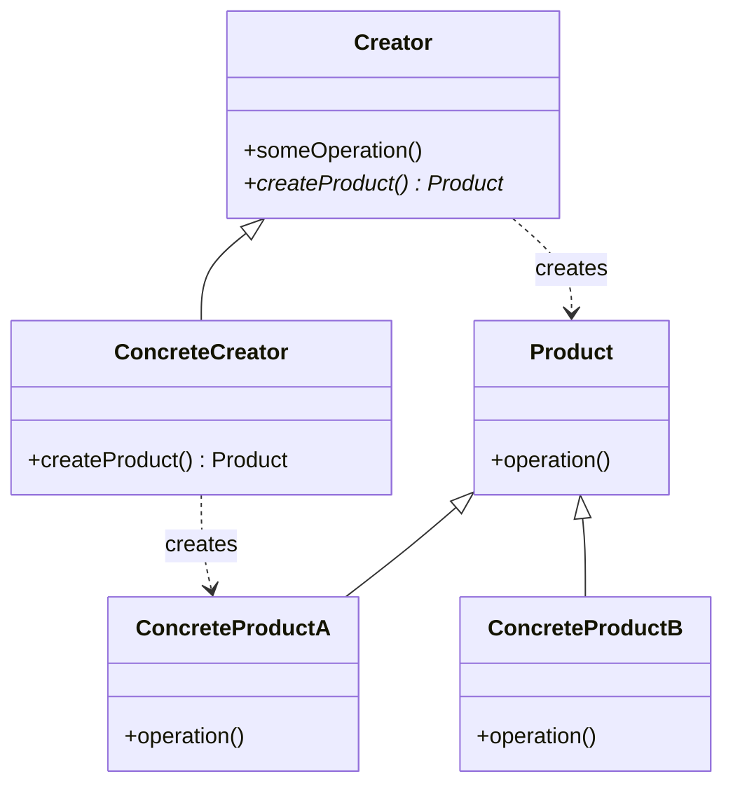
```mermaid
classDiagram
    class Creator {
        +someOperation()
        +createProduct()* Product
    }
    class ConcreteCreator {
        +createProduct() Product
    }
    class Product {
        +operation()
    }
    class ConcreteProductA {
        +operation()
    }
    class ConcreteProductB {
        +operation()
    }

    Creator <|-- ConcreteCreator
    Product <|-- ConcreteProductA
    Product <|-- ConcreteProductB
    Creator ..> Product : creates
    ConcreteCreator ..> ConcreteProductA : creates
```

#### C++ 实现

```cpp
// 产品接口
class Parser {
public:
    virtual ~Parser() = default;
    virtual Document parse(const QString& filePath) = 0;
};

class JsonParser : public Parser {
public:
    Document parse(const QString& filePath) override {
        qDebug() << "Parsing JSON:" << filePath;
        return Document{};
    }
};

class XmlParser : public Parser {
public:
    Document parse(const QString& filePath) override {
        qDebug() << "Parsing XML:" << filePath;
        return Document{};
    }
};

// 创建者（工厂方法由子类实现）
class DocumentEditor {
public:
    virtual ~DocumentEditor() = default;

    // 模板方法：定义算法骨架，将创建步骤延迟到子类
    void openDocument(const QString& path) {
        auto parser = createParser(path);  // 工厂方法
        auto doc = parser->parse(path);
        m_currentDoc = doc;
        render();
    }

protected:
    virtual std::unique_ptr<Parser> createParser(const QString& path) = 0;

private:
    void render() { /* 通用渲染逻辑 */ }
    Document m_currentDoc;
};

class JsonEditor : public DocumentEditor {
protected:
    std::unique_ptr<Parser> createParser(const QString&) override {
        return std::make_unique<JsonParser>();
    }
};
```

#### Qt 中的工厂方法

```cpp
// QMimeDatabase 根据文件内容决定创建哪种类型的对象
QMimeDatabase db;
QMimeType mime = db.mimeTypeForFile("data.json");
// mime.name() == "application/json" → 内部根据 MIME 类型"创建"不同的处理器

// 实际模式：Qt 插件系统
// 加载插件时，每个插件提供一个"工厂方法"来创建具体实例
QPluginLoader loader("plugins/myformat.dll");
auto* factory = qobject_cast<FormatFactoryInterface*>(loader.instance());
auto* parser = factory->createParser();  // 工厂方法
```

### 3.3 Abstract Factory（抽象工厂）

> **意图**：提供一个接口来创建**一系列相关或相互依赖的对象**，而无需指定它们的具体类。

#### 问题场景

跨平台 UI 库需要根据操作系统创建一整套匹配的控件（按钮、输入框、下拉菜单）。不能混用——Windows 按钮 + macOS 下拉菜单在 macOS 上看起来会很突兀。

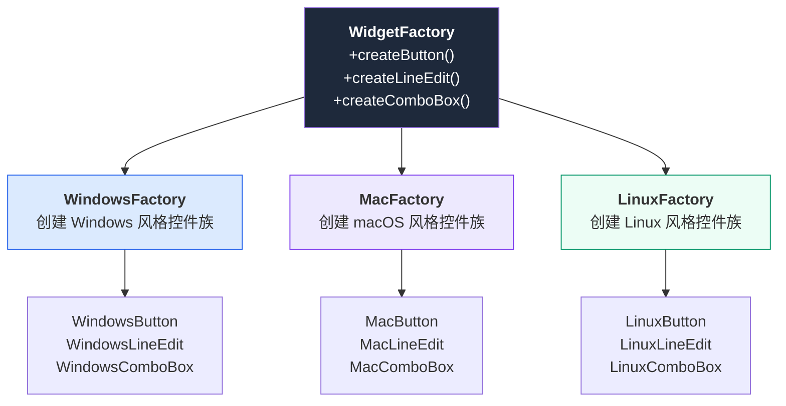
```mermaid
flowchart TD
    WF["<b>WidgetFactory</b><br>+createButton()<br>+createLineEdit()<br>+createComboBox()"]
    WF --> Win["<b>WindowsFactory</b><br>创建 Windows 风格控件族"]
    WF --> Mac["<b>MacFactory</b><br>创建 macOS 风格控件族"]
    WF --> Linux["<b>LinuxFactory</b><br>创建 Linux 风格控件族"]
    Win --> WinP["WindowsButton<br>WindowsLineEdit<br>WindowsComboBox"]
    Mac --> MacP["MacButton<br>MacLineEdit<br>MacComboBox"]
    Linux --> LinuxP["LinuxButton<br>LinuxLineEdit<br>LinuxComboBox"]

    style WF fill:#1e293b,color:#fff
    style Win fill:#dbeafe,stroke:#2563eb
    style Mac fill:#ede9fe,stroke:#7c3aed
    style Linux fill:#ecfdf5,stroke:#059669
```

#### C++ 实现

```cpp
// 抽象产品
class Button {
public:
    virtual ~Button() = default;
    virtual void render() = 0;
};

class LineEdit {
public:
    virtual ~LineEdit() = default;
    virtual void render() = 0;
};

// 具体产品族 — Windows
class WindowsButton : public Button {
public:
    void render() override { /* GDI 绘制 */ }
};
class WindowsLineEdit : public LineEdit {
public:
    void render() override { /* GDI 绘制 */ }
};

// 具体产品族 — macOS
class MacButton : public Button {
public:
    void render() override { /* Metal 绘制 */ }
};
class MacLineEdit : public LineEdit {
public:
    void render() override { /* Metal 绘制 */ }
};

// 抽象工厂
class WidgetFactory {
public:
    virtual ~WidgetFactory() = default;
    virtual std::unique_ptr<Button> createButton() = 0;
    virtual std::unique_ptr<LineEdit> createLineEdit() = 0;
};

// 具体工厂
class WindowsWidgetFactory : public WidgetFactory {
public:
    std::unique_ptr<Button> createButton() override {
        return std::make_unique<WindowsButton>();
    }
    std::unique_ptr<LineEdit> createLineEdit() override {
        return std::make_unique<WindowsLineEdit>();
    }
};

// 客户端：与具体平台解耦
class Application {
    std::unique_ptr<WidgetFactory> m_factory;
public:
    Application(std::unique_ptr<WidgetFactory> factory)
        : m_factory(std::move(factory)) {}

    void buildUI() {
        auto btn = m_factory->createButton();
        auto edit = m_factory->createLineEdit();
        btn->render();
        edit->render();
        // ✅ 保证 btn 和 edit 属于同一个产品族
    }
};
```

#### Qt 中的抽象工厂

Qt 的风格系统本质上是抽象工厂：

```cpp
// QStyle 就是抽象工厂
// QWindowsStyle、QMacStyle、QFusionStyle 是具体工厂

QApplication::setStyle("Fusion");  // 切换整个控件族的风格

// QStyle 内部创建每个控件的绘制器
// style->drawControl(QStyle::CE_PushButton, ...)
// style->drawPrimitive(QStyle::PE_FrameLineEdit, ...)
```

### 3.4 Builder（建造者）

> **意图**：将复杂对象的**构建过程**与**表示**分离，使得同样的构建过程可以创建不同的表示。

#### 问题场景

创建一个 `HttpRequest` 对象，它有十几个可选参数（method, url, headers, body, timeout, retryCount, proxy, sslConfig...）。构造函数参数列表会很长，且大部分参数通常使用默认值。

#### 结构

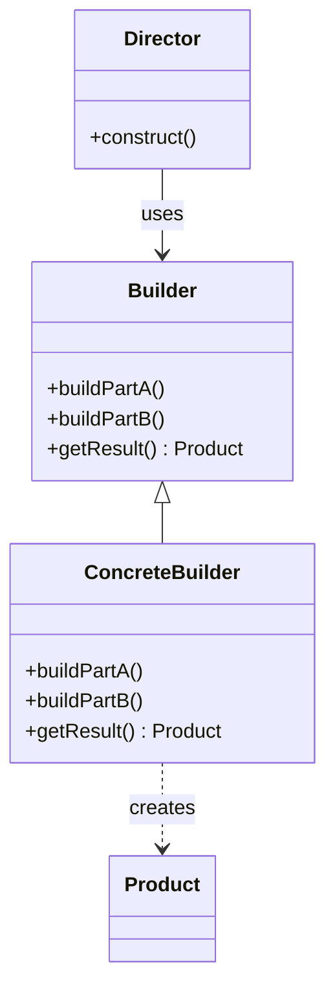
```mermaid
classDiagram
    class Director {
        +construct()
    }
    class Builder {
        +buildPartA()
        +buildPartB()
        +getResult() Product
    }
    class ConcreteBuilder {
        +buildPartA()
        +buildPartB()
        +getResult() Product
    }
    class Product {
    }

    Director --> Builder : uses
    Builder <|-- ConcreteBuilder
    ConcreteBuilder ..> Product : creates
```

#### C++ 实现（流式 Builder）

```cpp
class HttpRequest {
public:
    QString method;
    QString url;
    QMap<QString, QString> headers;
    QByteArray body;
    int timeoutMs = 5000;
    int retryCount = 0;

    // Builder 作为嵌套类
    class Builder {
    public:
        Builder& setMethod(const QString& method) {
            m_request.method = method;
            return *this;
        }
        Builder& setUrl(const QString& url) {
            m_request.url = url;
            return *this;
        }
        Builder& addHeader(const QString& key, const QString& val) {
            m_request.headers[key] = val;
            return *this;
        }
        Builder& setTimeout(int ms) {
            m_request.timeoutMs = ms;
            return *this;
        }
        Builder& setRetryCount(int n) {
            m_request.retryCount = n;
            return *this;
        }
        HttpRequest build() {
            // 在这里做验证
            Q_ASSERT(!m_request.url.isEmpty());
            return std::move(m_request);
        }
    private:
        HttpRequest m_request;
    };

private:
    HttpRequest() = default;  // 强制通过 Builder 创建
};

// 使用 — 流式调用，清晰易读
auto request = HttpRequest::Builder()
    .setMethod("POST")
    .setUrl("https://api.example.com/data")
    .addHeader("Authorization", "Bearer xxx")
    .addHeader("Content-Type", "application/json")
    .setTimeout(3000)
    .setRetryCount(2)
    .build();
```

#### Qt 中的 Builder

```cpp
// QProcess 的参数设置就是 Builder 模式
QProcess process;
process.setProgram("ffmpeg");
process.setArguments({"-i", "input.mp4", "-codec", "copy", "output.mkv"});
process.setWorkingDirectory("/tmp");
process.setProcessChannelMode(QProcess::MergedChannels);
process.start();  // build() 的等价物

// 更典型的场景：QNetworkRequest 的构造
QNetworkRequest request(QUrl("https://api.example.com"));
request.setHeader(QNetworkRequest::ContentTypeHeader, "application/json");
request.setRawHeader("Authorization", "Bearer xxx");
request.setTransferTimeout(5000);
// → 逐步"建造"一个复杂的请求对象
```

### 3.5 Prototype（原型）

> **意图**：通过**拷贝**已有对象来创建新对象，而不是通过 new。

#### 问题场景

一个图形编辑器中，用户选中一个已配置好的"红色虚线边框、阴影效果、圆角 8px"的矩形，想创建另一个同样样式的矩形。与其重新配置每个属性，不如直接**克隆**。

#### C++ 实现

```cpp
// 抽象原型
class Shape {
public:
    virtual ~Shape() = default;
    virtual std::unique_ptr<Shape> clone() const = 0;
    virtual void draw(QPainter& painter) = 0;

    // 属性
    QColor strokeColor = Qt::black;
    Qt::PenStyle strokeStyle = Qt::SolidLine;
    int cornerRadius = 0;
    QColor shadowColor = Qt::transparent;
};

class Rectangle : public Shape {
public:
    int width = 100;
    int height = 60;

    std::unique_ptr<Shape> clone() const override {
        return std::make_unique<Rectangle>(*this);  // 利用拷贝构造
    }

    void draw(QPainter& painter) override {
        painter.setPen(QPen(strokeColor, 1, strokeStyle));
        painter.drawRoundedRect(0, 0, width, height, cornerRadius, cornerRadius);
    }
};

// 使用
auto original = std::make_unique<Rectangle>();
original->strokeColor = Qt::red;
original->strokeStyle = Qt::DashLine;
original->cornerRadius = 8;
original->shadowColor = QColor(0, 0, 0, 50);

auto clone = original->clone();  // ✅ 获得一个相同配置的新对象
```

#### Qt 中的原型

```cpp
// QObject 没有 clone()（因为有 QObject 的拷贝语义限制）
// 但数据类通常支持拷贝：

QFont original("Arial", 14);
original.setBold(true);
original.setItalic(true);

QFont clone = original;  // QFont 有完善的拷贝构造 → 原型模式

// QGradient 也是
QLinearGradient grad(0, 0, 100, 100);
grad.setColorAt(0, Qt::red);
grad.setColorAt(1, Qt::blue);
// 无法直接 clone()，但拷贝构造同样实现了原型模式的意图
```

**创建型模式选择指南：**

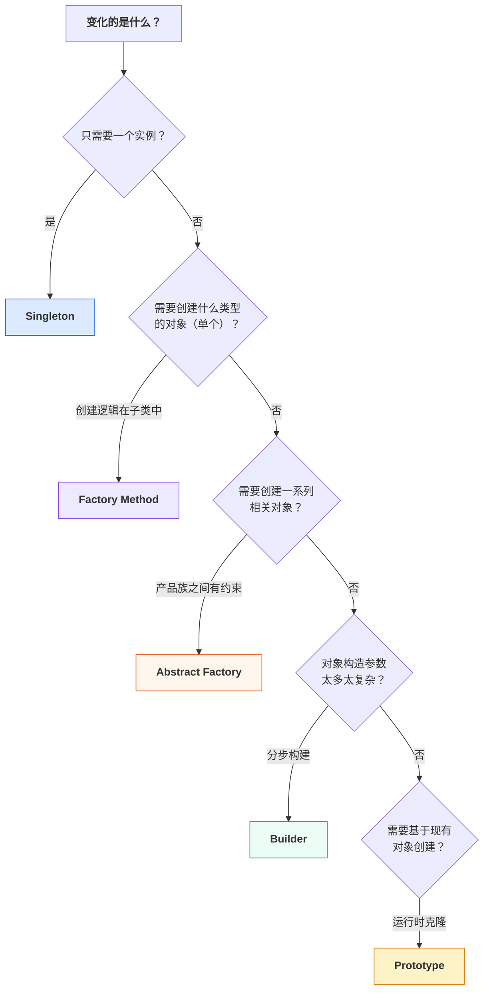
```mermaid
flowchart TD
    Q["<b>变化的是什么？</b>"] --> Q1{"只需要一个实例？"}
    Q1 -->|是| A1["<b>Singleton</b>"]
    Q1 -->|否| Q2{"需要创建什么类型<br>的对象（单个）？"}
    Q2 -->|创建逻辑在子类中| A2["<b>Factory Method</b>"]
    Q2 -->|否| Q3{"需要创建一系列<br>相关对象？"}
    Q3 -->|产品族之间有约束| A3["<b>Abstract Factory</b>"]
    Q3 -->|否| Q4{"对象构造参数<br>太多太复杂？"}
    Q4 -->|分步构建| A4["<b>Builder</b>"]
    Q4 -->|否| Q5{"需要基于现有<br>对象创建？"}
    Q5 -->|运行时克隆| A5["<b>Prototype</b>"]

    style A1 fill:#dbeafe,stroke:#2563eb
    style A2 fill:#ede9fe,stroke:#7c3aed
    style A3 fill:#fff7ed,stroke:#ea580c
    style A4 fill:#ecfdf5,stroke:#059669
    style A5 fill:#fef3c7,stroke:#d97706
```

---

## 4. 结构型模式（Structural Patterns）

结构型模式关注类和对象的组合方式，通过继承或组合来形成更大的结构。

### 4.1 Adapter（适配器）

> **意图**：将一个类的接口转换成客户端期望的另一个接口，使原本不兼容的类能一起工作。

#### 问题场景

你有一个第三方 JSON 库，接口是 `json_parse(const char*, size_t, JsonNode** output)`，但你的代码期望的是 `QJsonDocument fromJson(const QByteArray&)`。你需要一个**适配器**来桥接。

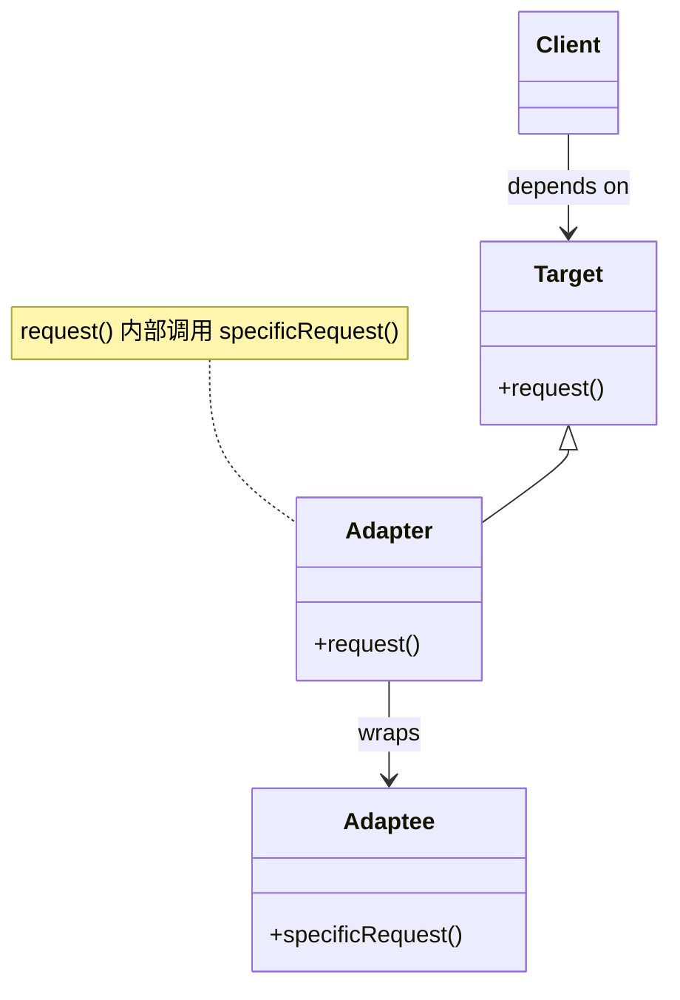
```mermaid
classDiagram
    class Client {
    }
    class Target {
        +request()
    }
    class Adapter {
        +request()
    }
    class Adaptee {
        +specificRequest()
    }

    Client --> Target : depends on
    Target <|-- Adapter
    Adapter --> Adaptee : wraps
    note for Adapter "request() 内部调用 specificRequest()"
```

#### C++ 实现（对象适配器）

```cpp
// Adaptee：第三方 JSON 库的接口（假设的旧式 C 风格）
class LegacyJsonLib {
public:
    bool parse(const std::string& text) {
        // 复杂的旧式解析逻辑...
        m_parsed = !text.empty();
        return m_parsed;
    }

    std::string getValue(const std::string& key) const {
        return m_data.value(key, "");
    }

private:
    bool m_parsed = false;
    std::map<std::string, std::string> m_data;
};

// Target：你期望的接口
class IJsonParser {
public:
    virtual ~IJsonParser() = default;
    virtual bool loadFromString(const QByteArray& data) = 0;
    virtual QVariant value(const QString& key) const = 0;
};

// Adapter：桥接两者
class LegacyJsonAdapter : public IJsonParser {
public:
    bool loadFromString(const QByteArray& data) override {
        return m_legacy.parse(data.toStdString());
    }

    QVariant value(const QString& key) const override {
        return QString::fromStdString(m_legacy.getValue(key.toStdString()));
    }

private:
    LegacyJsonLib m_legacy;  // 组合 Adaptee
};
```

#### Qt 中的适配器

```cpp
// QFileSystemModel → 适配文件系统数据到 QAbstractItemModel 接口
// QSqlTableModel → 适配数据库表到 QAbstractItemModel 接口
// 这样 QTableView、QListView 不需要知道数据来源是文件系统还是数据库

QFileSystemModel fileModel;         // 文件系统（Adaptee）
QSqlTableModel  sqlModel;           // 数据库（Adaptee）

QTableView view;                    // Client，只认识 QAbstractItemModel
view.setModel(&fileModel);          // ✅ 都能工作
view.setModel(&sqlModel);           // ✅ 因为适配器统一了接口
```

### 4.2 Bridge（桥接）

> **意图**：将**抽象**与**实现**分离，使两者可以独立变化。

#### 问题场景

一个通知系统需要支持多种**消息类型**（普通消息、紧急消息）和多种**发送渠道**（邮件、短信、推送）。如果为每种组合创建一个子类，会得到 `普通邮件通知`、`紧急邮件通知`、`普通短信通知`、`紧急短信通知`...——组合爆炸。

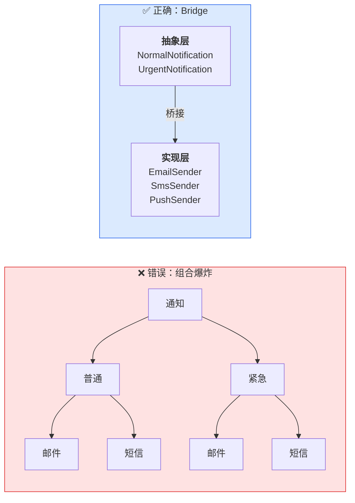
```mermaid
flowchart LR
    subgraph WRONG["❌ 错误：组合爆炸"]
        N["通知"] --> N1["普通"] --> N1a["邮件"]
        N1 --> N1b["短信"]
        N --> N2["紧急"] --> N2a["邮件"]
        N2 --> N2b["短信"]
    end

    subgraph RIGHT["✅ 正确：Bridge"]
        ABS["<b>抽象层</b><br>NormalNotification<br>UrgentNotification"]
        IMPL["<b>实现层</b><br>EmailSender<br>SmsSender<br>PushSender"]
        ABS -->|桥接| IMPL
    end

    style WRONG fill:#fee2e2,stroke:#dc2626
    style RIGHT fill:#dbeafe,stroke:#2563eb
```

#### C++ 实现

```cpp
// 实现层接口：发送渠道
class IMessageSender {
public:
    virtual ~IMessageSender() = default;
    virtual void send(const QString& title, const QString& body) = 0;
};

class EmailSender : public IMessageSender {
public:
    void send(const QString& title, const QString& body) override {
        qDebug() << "[Email]" << title << body;
    }
};

class SmsSender : public IMessageSender {
public:
    void send(const QString& title, const QString& body) override {
        qDebug() << "[SMS]" << title << body;
    }
};

// 抽象层：通知类型
class Notification {
protected:
    std::unique_ptr<IMessageSender> m_sender;  // 桥接 → 实现层

public:
    Notification(std::unique_ptr<IMessageSender> sender)
        : m_sender(std::move(sender)) {}
    virtual ~Notification() = default;
    virtual void notify(const QString& msg) = 0;
};

class NormalNotification : public Notification {
public:
    using Notification::Notification;  // 继承构造函数

    void notify(const QString& msg) override {
        m_sender->send("普通通知", msg);  // 委托给实现层
    }
};

class UrgentNotification : public Notification {
public:
    using Notification::Notification;

    void notify(const QString& msg) override {
        m_sender->send("【紧急】" + msg, "请立即处理！");
    }
};

// 使用 — 两个维度可以自由组合
auto emailNotify = std::make_unique<UrgentNotification>(
    std::make_unique<EmailSender>());
emailNotify->notify("服务器磁盘使用率 95%");

auto smsNotify = std::make_unique<NormalNotification>(
    std::make_unique<SmsSender>());
smsNotify->notify("周报已生成");
```

#### Qt 中的 Bridge

```cpp
// QAbstractButton 是著名的 Bridge 应用
//   抽象层：QAbstractButton、QPushButton、QCheckBox、QRadioButton
//   实现层：QStyle（负责实际绘制）

// 相同的行为（点击、选中） + 不同的平台绘制 = Bridge 的两个维度独立变化
QPushButton btn("确定");
// 绘制委托给 QStyle（实现层），按钮自身不关心绘制细节
btn.style();  // 返回 QStyle*，即桥接的实现层
```

### 4.3 Composite（组合）

> **意图**：将对象组合成**树形结构**来表示"部分-整体"层次，使客户端能一致地对待单个对象和组合对象。

#### 问题场景

文件系统中，文件夹可以包含文件和子文件夹。你希望对"计算总大小"这个操作，文件夹和单个文件使用相同的接口。

#### 结构

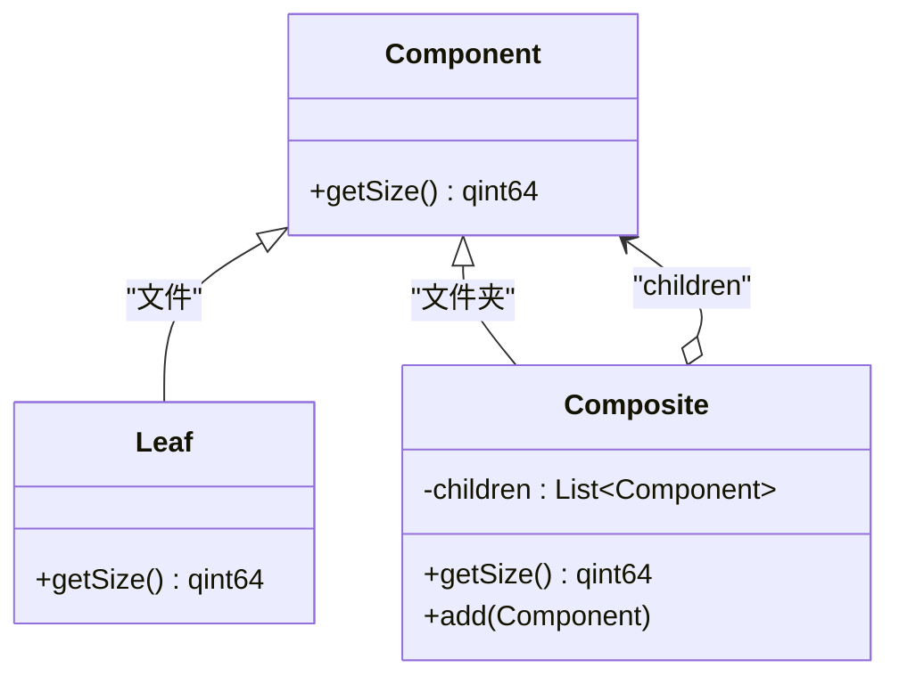
```mermaid
classDiagram
    class Component {
        +getSize() qint64
    }
    class Leaf {
        +getSize() qint64
    }
    class Composite {
        -children : List~Component~
        +getSize() qint64
        +add(Component)
    }

    Component <|-- Leaf : "文件"
    Component <|-- Composite : "文件夹"
    Composite o--> Component : "children"
```

#### C++ 实现

```cpp
// 组件接口
class FileSystemNode {
public:
    virtual ~FileSystemNode() = default;
    virtual qint64 getSize() const = 0;
    virtual QString name() const = 0;
};

// Leaf：普通文件
class File : public FileSystemNode {
public:
    File(const QString& name, qint64 size) : m_name(name), m_size(size) {}

    qint64 getSize() const override { return m_size; }
    QString name() const override { return m_name; }

private:
    QString m_name;
    qint64 m_size;
};

// Composite：文件夹
class Directory : public FileSystemNode {
public:
    Directory(const QString& name) : m_name(name) {}

    void add(std::unique_ptr<FileSystemNode> node) {
        m_children.push_back(std::move(node));
    }

    qint64 getSize() const override {
        qint64 total = 0;
        for (const auto& child : m_children)
            total += child->getSize();  // 递归求和
        return total;
    }

    QString name() const override { return m_name; }

private:
    QString m_name;
    std::vector<std::unique_ptr<FileSystemNode>> m_children;
};

// 使用 — 客户端代码不需要区分文件和文件夹
auto root = std::make_unique<Directory>("root");
auto docs = std::make_unique<Directory>("docs");
docs->add(std::make_unique<File>("readme.md", 2048));
docs->add(std::make_unique<File>("guide.pdf", 15360));
root->add(std::move(docs));
root->add(std::make_unique<File>("config.json", 512));

qDebug() << root->getSize();  // 17920 — 递归汇总，客户端不关心内部结构
```

#### Qt 中的 Composite

Qt 的核心——**QObject 对象树**就是 Composite 模式最典型的应用：

```cpp
QObject* parent = new QObject;

// QObject 的 children() 存储子对象列表
auto* child1 = new QObject(parent);    // QTimer
auto* child2 = new QObject(parent);    // QNetworkAccessManager

// parent 析构时自动析构所有子对象 → Composite 的内存管理
delete parent;
// child1, child2 也会被自动 delete

// QLayout 体系也是 Composite
QVBoxLayout* mainLayout = new QVBoxLayout;
mainLayout->addLayout(new QHBoxLayout);  // 嵌套布局
mainLayout->addWidget(new QPushButton);
// QWidget::setLayout() → layout() → 递归 layout()
```

### 4.4 Decorator（装饰器）

> **意图**：动态地给对象添加额外的职责，比继承更灵活。

#### 问题场景

你有一个基础的 `Stream` 类，需要支持多种叠加功能：压缩、加密、缓冲。如果为每种组合创建子类（`CompressedStream`、`EncryptedStream`、`CompressedEncryptedStream`...），又是组合爆炸。

#### 结构

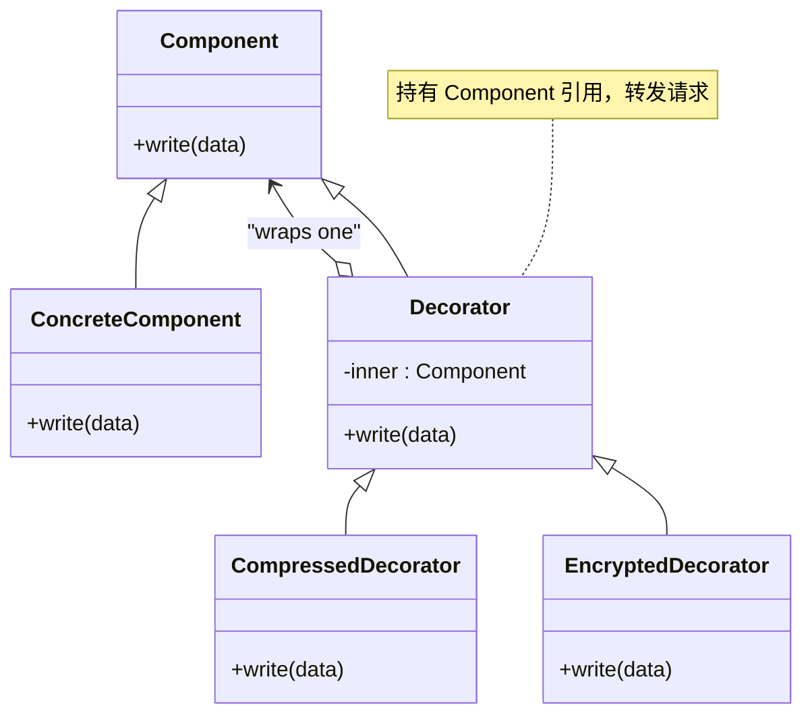
```mermaid
classDiagram
    class Component {
        +write(data)
    }
    class ConcreteComponent {
        +write(data)
    }
    class Decorator {
        -inner : Component
        +write(data)
    }
    class CompressedDecorator {
        +write(data)
    }
    class EncryptedDecorator {
        +write(data)
    }

    Component <|-- ConcreteComponent
    Component <|-- Decorator
    Decorator <|-- CompressedDecorator
    Decorator <|-- EncryptedDecorator
    Decorator o--> Component : "wraps one"
    note for Decorator "持有 Component 引用，转发请求"
```

#### C++ 实现

```cpp
// 组件接口
class IDataStream {
public:
    virtual ~IDataStream() = default;
    virtual void write(const QByteArray& data) = 0;
};

// 具体组件：原始文件写入
class FileStream : public IDataStream {
public:
    FileStream(const QString& path) : m_file(path) {
        m_file.open(QIODevice::WriteOnly);
    }

    void write(const QByteArray& data) override {
        m_file.write(data);
    }

private:
    QFile m_file;
};

// 装饰器基类
class StreamDecorator : public IDataStream {
protected:
    std::unique_ptr<IDataStream> m_inner;  // 被装饰的对象

public:
    StreamDecorator(std::unique_ptr<IDataStream> inner)
        : m_inner(std::move(inner)) {}
};

// 具体装饰器：压缩
class CompressedStream : public StreamDecorator {
public:
    using StreamDecorator::StreamDecorator;

    void write(const QByteArray& data) override {
        QByteArray compressed = qCompress(data, 9);  // 先压缩
        m_inner->write(compressed);                   // 再传给下一层
    }
};

// 具体装饰器：加密
class EncryptedStream : public StreamDecorator {
public:
    using StreamDecorator::StreamDecorator;

    void write(const QByteArray& data) override {
        QByteArray encrypted = aesEncrypt(data, m_key);  // 先加密
        m_inner->write(encrypted);                        // 再传给下一层
    }

private:
    QByteArray m_key = "my-secret-key";
};

// 使用 — 像洋葱一样层层包裹
auto stream = std::make_unique<FileStream>("data.bin");
stream = std::make_unique<CompressedStream>(std::move(stream));
stream = std::make_unique<EncryptedStream>(std::move(stream));
// 调用链: Encrypted → Compressed → FileStream
stream->write(someData);
```

### 4.5 Facade（外观）

> **意图**：为子系统中的一组接口提供一个**统一的高层接口**，简化子系统的使用。

#### 问题场景

编译一个 C++ 项目需要：预处理 → 编译 → 汇编 → 链接。每个步骤都有独立的类和复杂的配置。给调用者暴露一个 `build()` 方法就好。

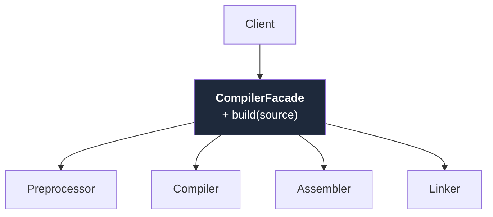
```mermaid
flowchart TD
    CLIENT["Client"]
    FACADE["<b>CompilerFacade</b><br>+ build(source)"]
    CLIENT --> FACADE
    FACADE --> PRE["Preprocessor"]
    FACADE --> COM["Compiler"]
    FACADE --> ASM["Assembler"]
    FACADE --> LINK["Linker"]

    style FACADE fill:#1e293b,color:#fff
```

#### C++ / Qt 实现

```cpp
class Preprocessor {
public:
    QString run(const QString& source) { /* 宏展开、头文件展开 */ return source; }
};

class Compiler {
public:
    QByteArray compile(const QString& preprocessed) { /* AST → IR */ return {}; }
};

class Assembler {
public:
    QByteArray assemble(const QByteArray& ir) { /* IR → 机器码 */ return {}; }
};

class Linker {
public:
    QByteArray link(const QByteArray& obj, const QList<QByteArray>& libs) { return {}; }
};

// Facade：屏蔽内部复杂性
class CompilerFacade {
public:
    QByteArray build(const QString& sourceFile) {
        QFile file(sourceFile);
        file.open(QIODevice::ReadOnly);
        QString source = file.readAll();

        QString preprocessed = m_preprocessor.run(source);
        QByteArray ir = m_compiler.compile(preprocessed);
        QByteArray obj = m_assembler.assemble(ir);
        return m_linker.link(obj, m_libraries);
    }

    void addLibrary(const QByteArray& lib) {
        m_libraries.append(lib);
    }

private:
    Preprocessor m_preprocessor;
    Compiler     m_compiler;
    Assembler    m_assembler;
    Linker       m_linker;
    QList<QByteArray> m_libraries;
};

// 使用
CompilerFacade facade;
facade.addLibrary("libstdc++.so");
QByteArray binary = facade.build("main.cpp");
```

#### Qt 中的 Facade

```cpp
// QFileDialog::getOpenFileName() 就是 Facade
// 背后调用了大量的 Windows/macOS/Linux 原生对话框 API
QString path = QFileDialog::getOpenFileName(
    nullptr, "打开文件", "", "Images (*.png *.jpg)"
);
// 一行代码搞定，不用关心平台差异

// QDesktopServices::openUrl() 同理
QDesktopServices::openUrl(QUrl("https://example.com"));
```

### 4.6 Flyweight（享元）

> **意图**：用共享来高效支持大量细粒度对象。

#### 问题场景

一个文本编辑器需要渲染 10 万行代码。如果每个字符都是一个独立对象（存储字体、大小、颜色、粗斜体...），内存会瞬间爆炸。但实际上，很多字符的**格式完全相同**——可以共享格式对象。

#### C++ 实现

```cpp
// 享元：被共享的"内在状态"（不变的）
class CharacterStyle {
public:
    CharacterStyle(const QFont& font, const QColor& color)
        : m_font(font), m_color(color) {}

    void apply(QPainter& p) const {
        p.setFont(m_font);
        p.setPen(m_color);
    }

    // 用于哈希比较
    bool operator==(const CharacterStyle& o) const {
        return m_font == o.m_font && m_color == o.m_color;
    }

private:
    QFont m_font;
    QColor m_color;
};

// 哈希函数
inline size_t qHash(const CharacterStyle& s, size_t seed = 0) {
    return qHash(s.m_font.toString()) ^ qHash(s.m_color.name());
}

// 享元工厂
class StyleFactory {
public:
    const CharacterStyle& getStyle(const QFont& font, const QColor& color) {
        CharacterStyle key(font, color);
        auto it = m_pool.find(key);
        if (it != m_pool.end())
            return *it;  // 返回已有的共享对象

        auto* style = new CharacterStyle(font, color);
        m_pool.insert(style);
        return *style;
    }

    ~StyleFactory() { qDeleteAll(m_pool); }

private:
    QSet<CharacterStyle*> m_pool;
};

// 使用：每个字符只存储"外在状态"（位置、字符内容）+ 指向共享格式的指针
struct Character {
    QChar ch;
    int x, y;
    const CharacterStyle* style;  // 指向共享的格式对象
};
```

#### Qt 中的 Flyweight

```cpp
// QFontCache / QPixmapCache 是享元模式的实例
QPixmapCache::insert("icon-home", QPixmap(":/icons/home.png"));
// 之后按 key 获取，不会重复加载

// QIcon 内部也共享像素数据
QIcon icon(":/icons/home.png");
auto sizes = icon.availableSizes();  // 不同尺寸共享同一份源数据
```

### 4.7 Proxy（代理）

> **意图**：为另一个对象提供一个**替身**或**占位符**，以控制对它的访问。

#### 变体

| 代理类型 | 用途 |
|---------|------|
| **Virtual Proxy（虚拟代理）** | 延迟创建开销大的对象 |
| **Remote Proxy（远程代理）** | 代表位于不同地址空间的对象 |
| **Protection Proxy（保护代理）** | 控制访问权限 |
| **Smart Reference（智能引用）** | 在访问对象时附加额外操作（引用计数、日志） |

#### C++ 实现（虚拟代理）

```cpp
// Subject 接口
class IImage {
public:
    virtual ~IImage() = default;
    virtual void display(QPainter& p, int x, int y) = 0;
    virtual QSize size() const = 0;
};

// RealSubject：真正加载图片（开销大）
class HighResImage : public IImage {
public:
    explicit HighResImage(const QString& path)
        : m_pixmap(path)  // 加载可能很慢，占内存很大
    {
        qDebug() << "Loading image from disk:" << path;
    }

    void display(QPainter& p, int x, int y) override {
        p.drawPixmap(x, y, m_pixmap);
    }

    QSize size() const override { return m_pixmap.size(); }

private:
    QPixmap m_pixmap;
};

// Proxy：延迟加载
class LazyImageProxy : public IImage {
public:
    explicit LazyImageProxy(const QString& path)
        : m_path(path) {}

    void display(QPainter& p, int x, int y) override {
        ensureLoaded();
        m_realImage->display(p, x, y);
    }

    QSize size() const override {
        ensureLoaded();
        return m_realImage->size();
    }

private:
    void ensureLoaded() const {
        if (!m_realImage)
            m_realImage = std::make_unique<HighResImage>(m_path);
    }

    QString m_path;
    mutable std::unique_ptr<HighResImage> m_realImage;  // 可变的缓存
};

// 使用
LazyImageProxy img("huge-photo.jpg");
// 此时还没有加载文件，内存占用极低
// 只有当真正需要绘制时才去加载
```

#### Qt 中的 Proxy

```cpp
// QSortFilterProxyModel — 代理模式 + 额外过滤/排序功能
QSortFilterProxyModel proxy;
proxy.setSourceModel(originalModel);  // 代理原始模型
proxy.setFilterRegExp(QRegExp("*.cpp"));  // 额外功能：过滤

QTableView view;
view.setModel(&proxy);  // view 不需要知道数据被过滤了

// QNetworkAccessManager 的缓存机制也是代理
QNetworkRequest req(url);
req.setAttribute(QNetworkRequest::CacheLoadControlAttribute,
                 QNetworkRequest::PreferCache);
```

---

## 5. 行为型模式（Behavioral Patterns）

行为型模式关注对象之间的通信和职责分配。

### 5.1 Chain of Responsibility（责任链）

> **意图**：将请求沿一条处理者链传递，直到有处理者处理它。

#### 问题场景

Web 服务器的请求处理：请求进来后，依次经过"认证检查 → 权限检查 → 频率限制 → 参数验证 → 业务处理"。每个环节可以**通过**（传给下一个）或**拒绝**（终止链）。

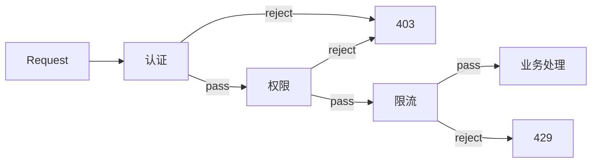
```mermaid
flowchart LR
    REQ["Request"] --> AUTH["认证"]
    AUTH -->|"pass"| PERM["权限"]
    AUTH -->|"reject"| E403["403"]
    PERM -->|"pass"| LIMIT["限流"]
    PERM -->|"reject"| E403
    LIMIT -->|"pass"| BIZ["业务处理"]
    LIMIT -->|"reject"| E429["429"]
```

#### C++ 实现

```cpp
class HttpRequest {
public:
    QString token;
    QString userId;
    QString path;
};

// 处理者基类
class Handler {
protected:
    Handler* m_next = nullptr;

public:
    virtual ~Handler() = default;

    Handler& setNext(Handler& next) {
        m_next = &next;
        return next;  // 返回引用以便链式调用
    }

    virtual void handle(HttpRequest& req) {
        if (m_next)
            m_next->handle(req);  // 默认：传给下一个
    }
};

class AuthHandler : public Handler {
public:
    void handle(HttpRequest& req) override {
        if (req.token.isEmpty()) {
            qDebug() << "403: No token";
            return;  // 中断链
        }
        qDebug() << "Auth passed";
        Handler::handle(req);  // 传给下一个
    }
};

class ThrottleHandler : public Handler {
public:
    void handle(HttpRequest& req) override {
        if (m_requestCount > 100) {
            qDebug() << "429: Too many requests";
            return;
        }
        m_requestCount++;
        qDebug() << "Throttle passed";
        Handler::handle(req);
    }

private:
    int m_requestCount = 0;
};

// 使用 — 链式组装
AuthHandler auth;
ThrottleHandler throttle;

auth.setNext(throttle);  // auth → throttle

HttpRequest req;
req.token = "valid-token";
auth.handle(req);  // 从链头开始
```

#### Qt 中的责任链

Qt 的**事件系统**就是责任链——事件从子 widget 向父 widget 传递，直到被处理：

```cpp
// QWidget 事件传播链：target → parent → grandparent → ...
// 每个 widget 都可以处理或忽略事件
void MyWidget::mousePressEvent(QMouseEvent* event) {
    if (canHandle(event)) {
        // 处理它 → 链终止
    } else {
        QWidget::mousePressEvent(event);  // 传给父类（链上的下一个）
    }
}
```

### 5.2 Command（命令）

> **意图**：将**请求封装为对象**，从而支持参数化、队列、日志和撤销操作。

#### 问题场景

编辑器中的"撤销/重做"功能。每个操作（插入文字、删除文字、修改格式）都需要保存足够的状态来撤销。普通的方法调用无法做到这一点——需要将操作**对象化**。

#### 结构

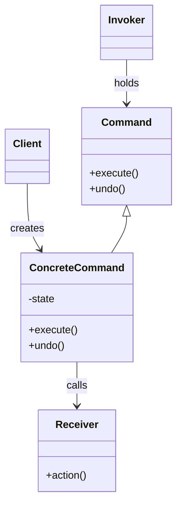
```mermaid
classDiagram
    class Client {
    }
    class Invoker {
    }
    class Command {
        +execute()
        +undo()
    }
    class ConcreteCommand {
        -state
        +execute()
        +undo()
    }
    class Receiver {
        +action()
    }

    Client --> ConcreteCommand : creates
    Invoker --> Command : holds
    Command <|-- ConcreteCommand
    ConcreteCommand --> Receiver : calls
```

#### C++ 实现（撤销/重做）

```cpp
// Receiver：真正执行操作的对象
class TextEditor {
public:
    void insertText(int pos, const QString& text) {
        m_content.insert(pos, text);
    }

    void deleteText(int pos, int length) {
        m_deleted = m_content.mid(pos, length);
        m_content.remove(pos, length);
    }

    QString content() const { return m_content; }

private:
    QString m_content;
    QString m_deleted;
};

// Command 基类
class Command {
public:
    virtual ~Command() = default;
    virtual void execute() = 0;
    virtual void undo() = 0;
};

// 具体命令：插入文本
class InsertCommand : public Command {
public:
    InsertCommand(TextEditor& editor, int pos, const QString& text)
        : m_editor(editor), m_pos(pos), m_text(text) {}

    void execute() override {
        m_editor.insertText(m_pos, m_text);
    }

    void undo() override {
        m_editor.deleteText(m_pos, m_text.length());
    }

private:
    TextEditor& m_editor;
    int m_pos;
    QString m_text;
};

// Invoker：管理命令历史
class CommandHistory {
public:
    void execute(std::unique_ptr<Command> cmd) {
        cmd->execute();
        m_undoStack.push_back(std::move(cmd));
        m_redoStack.clear();  // 新命令清空重做栈
    }

    void undo() {
        if (m_undoStack.empty()) return;
        auto& cmd = m_undoStack.back();
        cmd->undo();
        m_redoStack.push_back(std::move(cmd));
        m_undoStack.pop_back();
    }

    void redo() {
        if (m_redoStack.empty()) return;
        auto& cmd = m_redoStack.back();
        cmd->execute();
        m_undoStack.push_back(std::move(cmd));
        m_redoStack.pop_back();
    }

private:
    std::vector<std::unique_ptr<Command>> m_undoStack;
    std::vector<std::unique_ptr<Command>> m_redoStack;
};

// 使用
TextEditor editor;
CommandHistory history;
editor.insertText(0, "Hello");
history.execute(std::make_unique<InsertCommand>(editor, 5, " World"));
// editor.content() == "Hello World"
history.undo();
// editor.content() == "Hello"
history.redo();
// editor.content() == "Hello World"
```

#### Qt 中的 Command

Qt 的 **QUndoStack / QUndoCommand** 就是 Command 模式的完整实现：

```cpp
class InsertTextCmd : public QUndoCommand {
public:
    InsertTextCmd(QTextDocument* doc, int pos, const QString& text)
        : m_doc(doc), m_pos(pos), m_text(text) {
        setText("插入文本");  // 在 Undo 菜单中显示
    }

    void redo() override {
        QTextCursor cursor(m_doc);
        cursor.setPosition(m_pos);
        cursor.insertText(m_text);
    }

    void undo() override {
        QTextCursor cursor(m_doc);
        cursor.setPosition(m_pos);
        cursor.movePosition(QTextCursor::Right, QTextCursor::KeepAnchor,
                            m_text.length());
        cursor.removeSelectedText();
    }

private:
    QTextDocument* m_doc;
    int m_pos;
    QString m_text;
};

QUndoStack undoStack;
undoStack.push(new InsertTextCmd(doc, 0, "Hello Qt"));
// 自动支持 Undo/Redo 快捷键和菜单集成
```

### 5.3 Iterator（迭代器）

> **意图**：提供一种方法**顺序访问**聚合对象中的各个元素，而**不暴露其内部表示**。

#### C++ / Qt 实现

C++ STL 和 Qt 的迭代器是这个模式最经典的实现：

```cpp
// STL 风格
std::vector<int> vec = {1, 2, 3, 4, 5};
for (auto it = vec.begin(); it != vec.end(); ++it) {
    qDebug() << *it;
}

// Qt 风格 — Java 风格迭代器（更安全）
QList<QString> list = {"a", "b", "c"};
QListIterator<QString> it(list);
while (it.hasNext()) {
    qDebug() << it.next();
}

// Qt 风格 — STL 风格迭代器（更高效）
for (auto it = list.begin(); it != list.end(); ++it) {
    *it = it->toUpper();
}

// C++11 range-for（语法糖，底层用 begin()/end()）
for (const auto& item : list) {
    qDebug() << item;
}
```

#### 自定义迭代器

```cpp
// 自定义可迭代容器
template<typename T>
class TreeNode {
public:
    T data;
    std::vector<std::unique_ptr<TreeNode>> children;

    // 前序遍历迭代器（简化示意）
    class PreOrderIterator {
        std::vector<TreeNode*> m_stack;

    public:
        explicit PreOrderIterator(TreeNode* root) {
            if (root) m_stack.push_back(root);
        }

        T& operator*() { return m_stack.back()->data; }
        PreOrderIterator& operator++() {
            auto* node = m_stack.back();
            m_stack.pop_back();
            // 逆序压入子节点
            for (auto it = node->children.rbegin();
                 it != node->children.rend(); ++it) {
                m_stack.push_back(it->get());
            }
            return *this;
        }
        bool operator!=(const PreOrderIterator&) const {
            return !m_stack.empty();
        }
    };

    PreOrderIterator begin() { return PreOrderIterator(this); }
    PreOrderIterator end()   { return PreOrderIterator(nullptr); }
};
```

### 5.4 Mediator（中介者）

> **意图**：用一个**中介对象**来封装一组对象之间的交互，避免它们之间显式的相互引用。

#### 问题场景

一个对话框中有多个控件相互影响：勾选复选框 → 禁用输入框 → 启用按钮 → 更新标签...如果每个控件都直接引用其他控件，会产生蜘蛛网式的依赖。

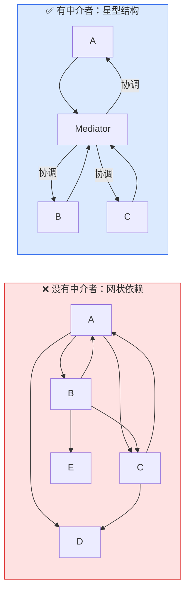
```mermaid
flowchart LR
    subgraph WRONG["❌ 没有中介者：网状依赖"]
        A1["A"] --> B1["B"]
        A1 --> C1["C"]
        A1 --> D1["D"]
        B1 --> A1
        B1 --> C1
        B1 --> E1["E"]
        C1 --> A1
        C1 --> D1
    end

    subgraph RIGHT["✅ 有中介者：星型结构"]
        A2["A"] --> MED["Mediator"]
        B2["B"] --> MED
        C2["C"] --> MED
        MED -->|"协调"| A2
        MED -->|"协调"| B2
        MED -->|"协调"| C2
    end

    style WRONG fill:#fee2e2,stroke:#dc2626
    style RIGHT fill:#dbeafe,stroke:#2563eb
```

#### C++ / Qt 实现

```cpp
// Mediator 接口
class DialogMediator {
public:
    virtual ~DialogMediator() = default;
    virtual void notify(QWidget* sender, const QString& event) = 0;
};

// 具体中介者：管理对话框各控件之间的交互逻辑
class LoginDialogMediator : public DialogMediator {
public:
    LoginDialogMediator(QLineEdit* username, QLineEdit* password,
                        QCheckBox* remember, QPushButton* login)
        : m_username(username), m_password(password),
          m_remember(remember), m_login(login)
    {
        // 安装事件过滤器来监听各控件变化
        m_username->installEventFilter(this);
        m_password->installEventFilter(this);
        m_remember->installEventFilter(this);
    }

    void notify(QWidget* sender, const QString& event) override {
        if (sender == m_remember) {
            // 记住密码：预填充上次的用户名
            if (m_remember->isChecked()) {
                m_username->setText(m_savedUsername);
            }
        }
        // 每次输入变化都检查登录按钮是否可点
        if (sender == m_username || sender == m_password) {
            m_login->setEnabled(
                !m_username->text().isEmpty() &&
                !m_password->text().isEmpty()
            );
        }
    }

private:
    QLineEdit* m_username;
    QLineEdit* m_password;
    QCheckBox* m_remember;
    QPushButton* m_login;
    QString m_savedUsername;
};
```

#### Qt 中的 Mediator

对话框类本身就是天然的中介者，而 Qt 的**信号槽机制**在很多场景下可以替代中介者：

```cpp
// 信号槽自动充当 Mediator：各控件不直接引用彼此
connect(checkBox, &QCheckBox::toggled, this, [this](bool checked) {
    lineEdit->setEnabled(!checked);  // 中介逻辑在对话框类中
    updateLoginButton();
});
connect(lineEdit, &QLineEdit::textChanged, this, &LoginDialog::updateLoginButton);
```

### 5.5 Memento（备忘录）

> **意图**：在不破坏封装性的前提下，**捕获并外部化**一个对象的内部状态，以便后续恢复。

#### 问题场景

游戏存档：需要保存角色的位置、血量、装备等状态，但不想暴露这些内部细节。

#### C++ 实现

```cpp
// Memento：不可变的状态快照
class PlayerMemento {
    friend class Player;  // 只有 Player 可以访问内部细节

    int m_x, m_y;
    int m_hp;
    int m_level;

    PlayerMemento(int x, int y, int hp, int level)
        : m_x(x), m_y(y), m_hp(hp), m_level(level) {}
};

// Originator：需要保存状态的对象
class Player {
public:
    void move(int dx, int dy) { m_x += dx; m_y += dy; }
    void takeDamage(int dmg) { m_hp -= dmg; }

    // 创建存档
    PlayerMemento save() const {
        return PlayerMemento(m_x, m_y, m_hp, m_level);
    }

    // 恢复存档
    void restore(const PlayerMemento& m) {
        m_x = m.m_x;
        m_y = m.m_y;
        m_hp = m.m_hp;
        m_level = m.m_level;
    }

    void print() const {
        qDebug() << "Pos:" << m_x << m_y
                 << "HP:" << m_hp << "Lv:" << m_level;
    }

private:
    int m_x = 0, m_y = 0;
    int m_hp = 100;
    int m_level = 1;
};

// Caretaker：管理者，不查看备忘录内容
class SaveManager {
public:
    void save(const Player& player, int slot) {
        m_saves[slot] = player.save();
    }

    bool load(Player& player, int slot) {
        auto it = m_saves.find(slot);
        if (it == m_saves.end()) return false;
        player.restore(it->second);
        return true;
    }

private:
    QMap<int, PlayerMemento> m_saves;  // 不关心内部结构
};

// 使用
Player player;
player.move(10, 20);

SaveManager sm;
sm.save(player, 1);        // 存档
player.takeDamage(30);
sm.load(player, 1);        // 读档 → 恢复
```

### 5.6 Observer（观察者）

> **意图**：定义对象间的一对多依赖关系，当一个对象**状态改变**时，所有依赖它的对象自动收到通知。

#### 问题场景

实时数据显示面板：一个数据源变化时，表格、图表、状态栏、日志窗口都需要同步刷新。

#### 结构

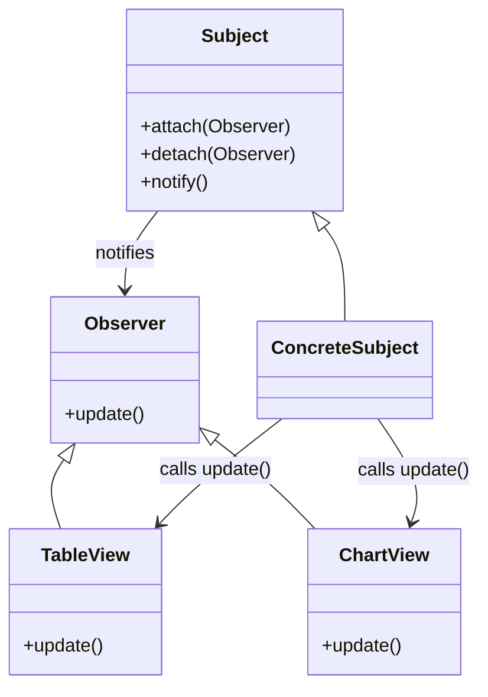
```mermaid
classDiagram
    class Subject {
        +attach(Observer)
        +detach(Observer)
        +notify()
    }
    class Observer {
        +update()
    }
    class ConcreteSubject {
    }
    class ConcreteObserverA["TableView"] {
        +update()
    }
    class ConcreteObserverB["ChartView"] {
        +update()
    }

    Subject <|-- ConcreteSubject
    Observer <|-- ConcreteObserverA
    Observer <|-- ConcreteObserverB
    Subject --> Observer : notifies
    ConcreteSubject --> ConcreteObserverA : calls update()
    ConcreteSubject --> ConcreteObserverB : calls update()
```

#### Qt 实现（信号槽）

Qt 的信号槽就是 Observer 模式的巅峰实现，无需手写 Subject/Observer 类：

```cpp
// Subject：数据源
class DataSource : public QObject {
    Q_OBJECT

public:
    void updateData(const QVariantList& data) {
        if (m_data != data) {
            m_data = data;
            emit dataChanged(m_data);  // 状态改变 → 通知所有观察者
        }
    }

signals:
    void dataChanged(const QVariantList& data);

private:
    QVariantList m_data;
};

// Observers
class TableView : public QObject {
    Q_OBJECT
public slots:
    void onDataChanged(const QVariantList& data) {
        qDebug() << "Table refreshing with" << data.size() << "rows";
    }
};

class ChartView : public QObject {
    Q_OBJECT
public slots:
    void onDataChanged(const QVariantList& data) {
        qDebug() << "Chart redrawing";
    }
};

// 使用
DataSource source;
TableView table;
ChartView chart;

QObject::connect(&source, &DataSource::dataChanged,
                 &table, &TableView::onDataChanged);
QObject::connect(&source, &DataSource::dataChanged,
                 &chart, &ChartView::onDataChanged);

source.updateData({{"CPU", 85}, {"RAM", 60}});
// 两个视图自动收到通知
```

#### Qt 的其他 Observer 实现

```cpp
// QFileSystemWatcher — 观察文件系统变化
QFileSystemWatcher watcher;
watcher.addPath("/var/log/app.log");
QObject::connect(&watcher, &QFileSystemWatcher::fileChanged,
                 [](const QString& path) {
    qDebug() << "Log file changed!";
});

// QAbstractItemModel + QAbstractItemView — 模型数据变化时自动刷新视图
// Model = Subject, View = Observer
model->setData(index, newValue);  // Model 发出 dataChanged 信号
// → 所有关联的 View 自动重绘
```

### 5.7 State（状态）

> **意图**：允许对象在其**内部状态改变**时改变它的行为，看起来好像对象修改了它的类。

#### 问题场景

TCP 连接对象在不同状态（CLOSED, LISTEN, SYN_SENT, ESTABLISHED...）下，对 `connect()`、`close()`、`send()` 的响应完全不同。用 if-else 堆叠会难以维护。

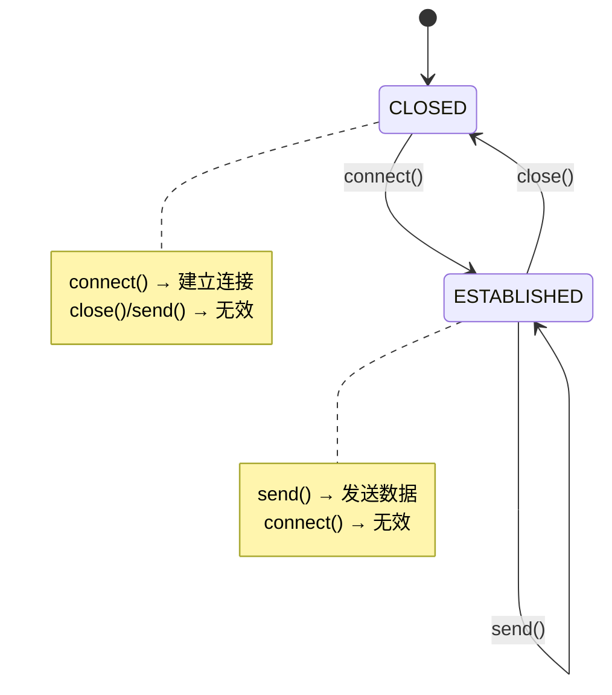
```mermaid
stateDiagram-v2
    [*] --> CLOSED
    CLOSED --> ESTABLISHED : connect()
    ESTABLISHED --> CLOSED : close()
    ESTABLISHED --> ESTABLISHED : send()

    note right of CLOSED : connect() → 建立连接<br>close()/send() → 无效
    note right of ESTABLISHED : send() → 发送数据<br>connect() → 无效
```

#### C++ 实现

```cpp
// State 基类
class TcpState {
public:
    virtual ~TcpState() = default;
    virtual void connect(TcpConnection* conn) { qDebug() << "Invalid in" << name(); }
    virtual void close(TcpConnection* conn)    { qDebug() << "Invalid in" << name(); }
    virtual void send(TcpConnection* conn, const QByteArray&) {
        qDebug() << "Invalid in" << name();
    }
    virtual QString name() const = 0;
};

// 具体状态
class ClosedState : public TcpState {
public:
    void connect(TcpConnection* conn) override;
    QString name() const override { return "CLOSED"; }
};

class EstablishedState : public TcpState {
public:
    void close(TcpConnection* conn) override;
    void send(TcpConnection* conn, const QByteArray& data) override;
    QString name() const override { return "ESTABLISHED"; }
};

// Context：持有当前状态
class TcpConnection {
    friend class ClosedState;
    friend class EstablishedState;

public:
    TcpConnection() : m_state(std::make_unique<ClosedState>()) {}

    void connect()   { m_state->connect(this); }
    void close()     { m_state->close(this); }
    void send(const QByteArray& data) { m_state->send(this, data); }

private:
    void changeState(std::unique_ptr<TcpState> newState) {
        qDebug() << m_state->name() << "→" << newState->name();
        m_state = std::move(newState);
    }

    std::unique_ptr<TcpState> m_state;
};

// 状态转换逻辑
void ClosedState::connect(TcpConnection* conn) {
    qDebug() << "建立连接...";
    conn->changeState(std::make_unique<EstablishedState>());
}

void EstablishedState::close(TcpConnection* conn) {
    qDebug() << "关闭连接...";
    conn->changeState(std::make_unique<ClosedState>());
}

void EstablishedState::send(TcpConnection* conn, const QByteArray& data) {
    qDebug() << "发送数据:" << data.size() << "bytes";
    // 实际发送逻辑
}

// 使用
TcpConnection conn;
conn.send("hello");   // "Invalid in CLOSED"
conn.connect();       // "CLOSED → ESTABLISHED"
conn.send("hello");   // "发送数据: 5 bytes"
conn.close();         // "ESTABLISHED → CLOSED"
```

#### Qt 中的 State

```cpp
// QStateMachine — Qt 内置的状态机框架，直接实现了 State 模式
QStateMachine machine;

QState* closed = new QState();
QState* established = new QState();

closed->addTransition(connectButton, &QPushButton::clicked, established);
established->addTransition(disconnectButton, &QPushButton::clicked, closed);

// 进入/退出状态时的行为
established->assignProperty(statusLabel, "text", "已连接");
closed->assignProperty(statusLabel, "text", "已断开");

machine.addState(closed);
machine.addState(established);
machine.setInitialState(closed);
machine.start();
```

### 5.8 Strategy（策略）

> **意图**：定义一系列算法，把它们封装起来，并使它们可以**互相替换**。

#### 问题场景

一个电商系统需要多种**促销策略**（满减、折扣、买赠），且这些策略可能在运行时动态切换。每种策略是一套独立的计算算法。

#### 结构

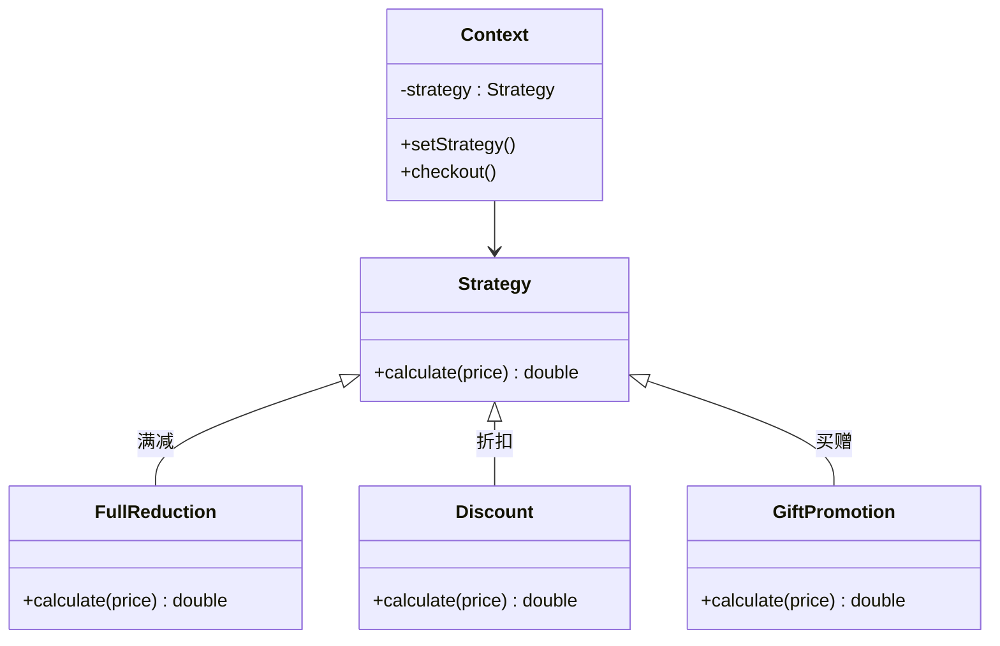
```mermaid
classDiagram
    class Context {
        -strategy : Strategy
        +setStrategy()
        +checkout()
    }
    class Strategy {
        +calculate(price) double
    }
    class FullReduction {
        +calculate(price) double
    }
    class Discount {
        +calculate(price) double
    }
    class GiftPromotion {
        +calculate(price) double
    }

    Context --> Strategy
    Strategy <|-- FullReduction : 满减
    Strategy <|-- Discount : 折扣
    Strategy <|-- GiftPromotion : 买赠
```

#### C++ 实现

```cpp
// 策略接口
class IPromotionStrategy {
public:
    virtual ~IPromotionStrategy() = default;
    virtual double calculate(double originalPrice) const = 0;
    virtual QString name() const = 0;
};

// 具体策略：满减
class FullReduction : public IPromotionStrategy {
public:
    FullReduction(double threshold, double reduction)
        : m_threshold(threshold), m_reduction(reduction) {}

    double calculate(double price) const override {
        int times = static_cast<int>(price / m_threshold);
        return price - times * m_reduction;
    }

    QString name() const override {
        return QString("满%1减%2").arg(m_threshold).arg(m_reduction);
    }

private:
    double m_threshold;
    double m_reduction;
};

// 具体策略：折扣
class Discount : public IPromotionStrategy {
public:
    Discount(double rate) : m_rate(rate) {}  // rate = 0.8 即 8 折

    double calculate(double price) const override {
        return price * m_rate;
    }

    QString name() const override {
        return QString("%1折").arg(m_rate * 10);
    }

private:
    double m_rate;
};

// Context
class Order {
public:
    void setStrategy(std::unique_ptr<IPromotionStrategy> strategy) {
        m_strategy = std::move(strategy);
    }

    double checkout(double originalPrice) const {
        if (m_strategy) {
            double final = m_strategy->calculate(originalPrice);
            qDebug() << m_strategy->name() << ":"
                     << originalPrice << "→" << final;
            return final;
        }
        return originalPrice;
    }

private:
    std::unique_ptr<IPromotionStrategy> m_strategy;
};

// 使用
Order order;
order.setStrategy(std::make_unique<FullReduction>(200, 30));
order.checkout(500);  // "满200减30: 500 → 440"

order.setStrategy(std::make_unique<Discount>(0.85));
order.checkout(500);  // "8.5折: 500 → 425"
```

#### Qt 中的 Strategy

```cpp
// QCompleter 的完成模式就是策略模式
QCompleter* completer = new QCompleter(wordList, this);
completer->setCompletionMode(QCompleter::PopupCompletion);    // 策略 A
completer->setCompletionMode(QCompleter::InlineCompletion);   // 策略 B
completer->setCompletionMode(QCompleter::UnfilteredPopupCompletion); // 策略 C

// QValidator 子类也是策略：IntValidator, DoubleValidator, RegExpValidator
QLineEdit edit;
edit.setValidator(new QIntValidator(0, 100));      // 策略 A：整数
edit.setValidator(new QDoubleValidator(0, 99.9, 2)); // 策略 B：浮点数
edit.setValidator(new QRegExpValidator(QRegExp("[A-Z]+"))); // 策略 C：正则
```

### 5.9 Template Method（模板方法）

> **意图**：在一个方法中定义算法的**骨架**，将一些步骤**延迟到子类**实现。

#### 问题场景

所有数据导出功能（导出 PDF、导出 CSV、导出 Excel）都遵循相同的流程：`准备数据 → 格式化 → 写入文件 → 清理`，但每个步骤的具体实现不同。

#### 结构

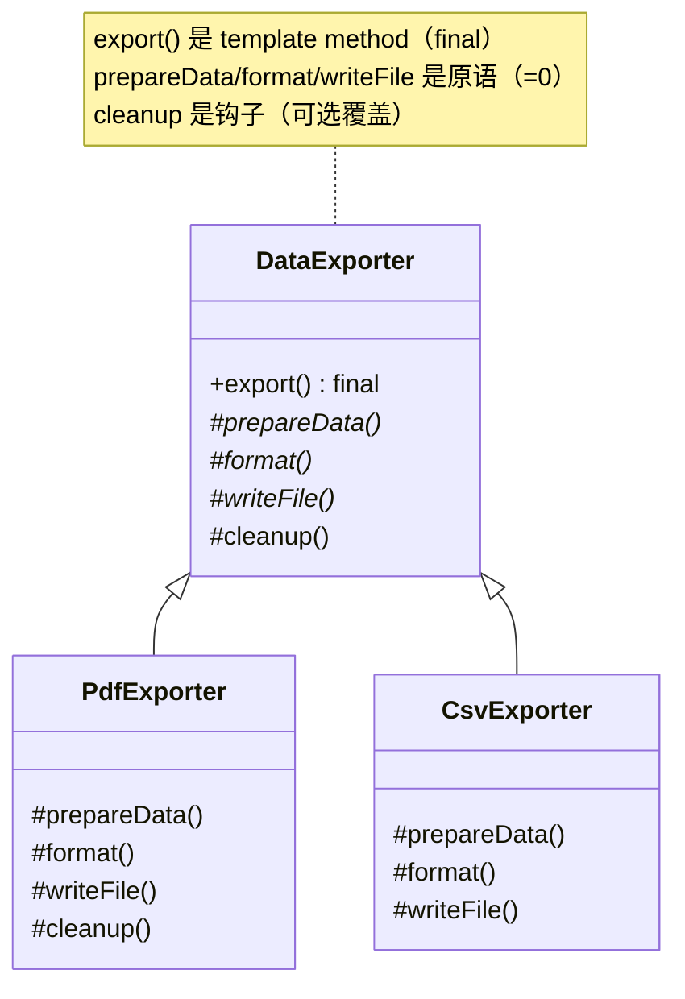
```mermaid
classDiagram
    class DataExporter {
        +export() final
        #prepareData()*
        #format()*
        #writeFile()*
        #cleanup()
    }
    class PdfExporter {
        #prepareData()
        #format()
        #writeFile()
        #cleanup()
    }
    class CsvExporter {
        #prepareData()
        #format()
        #writeFile()
    }

    DataExporter <|-- PdfExporter
    DataExporter <|-- CsvExporter
    note for DataExporter "export() 是 template method（final）<br>prepareData/format/writeFile 是原语（=0）<br>cleanup 是钩子（可选覆盖）"
```

#### C++ 实现

```cpp
class DataExporter {
public:
    virtual ~DataExporter() = default;

    // 模板方法 — final 禁止子类覆盖
    void exportData(const QList<QStringList>& data, const QString& path) final {
        m_data = data;
        m_path = path;

        qDebug() << "=== 开始导出 ===";
        prepareData();
        format();
        writeFile();
        cleanup();
        qDebug() << "=== 导出完成 ===";
    }

protected:
    virtual void prepareData() = 0;
    virtual void format() = 0;
    virtual void writeFile() = 0;

    // 钩子：有默认空实现，子类可以选择性覆盖
    virtual void cleanup() {
        m_data.clear();  // 默认清理数据
    }

    QList<QStringList> m_data;
    QString m_path;
};

class CsvExporter : public DataExporter {
protected:
    void prepareData() override {
        qDebug() << "CSV: Preparing data...";
    }

    void format() override {
        qDebug() << "CSV: Formatting rows...";
    }

    void writeFile() override {
        QFile file(m_path);
        file.open(QIODevice::WriteOnly);
        QTextStream stream(&file);
        for (const auto& row : m_data) {
            stream << row.join(',') << "\n";
        }
    }
};

class PdfExporter : public DataExporter {
protected:
    void prepareData() override { /* 构建 PDF 文档结构 */ }
    void format() override      { /* 设置字体、页面布局 */ }
    void writeFile() override   { QPdfWriter writer(m_path); /* ... */ }

    void cleanup() override {
        m_tempFiles.clear();  // 额外的清理：删除临时文件
        DataExporter::cleanup();
    }

private:
    QStringList m_tempFiles;
};
```

#### Qt 中的 Template Method

```cpp
// QThread::run() — 模板方法的核心
// start() 内部调用 run()，子类只需重写 run()
class WorkerThread : public QThread {
protected:
    void run() override {  // 实现算法步骤
        // 模板方法 start() 会调用这里
        while (!isInterruptionRequested()) {
            doWork();
            msleep(100);
        }
    }
};

// QAbstractItemModel 也是
// index(), parent(), rowCount(), columnCount(), data() 是原语
// 基类基于这些原语实现了 beginInsertRows(), endInsertRows() 等复杂方法
```

### 5.10 Visitor（访问者）

> **意图**：将**操作**与**对象结构**分离，使你可以不修改元素类而增加新的操作。

#### 问题场景

AST（抽象语法树）有各种节点类型：`NumberNode`、`PlusNode`、`FunctionCallNode`...需要对 AST 做多种操作：类型检查、代码生成、格式化输出。如果为每种操作在每个节点类添加方法，节点类会不断膨胀。

#### 结构

```mermaid
classDiagram
    class Visitor {
        +visit(NumberNode)
        +visit(PlusNode)
    }
    class TypeChecker {
        +visit(NumberNode)
        +visit(PlusNode)
    }
    class CodeGenerator {
        +visit(NumberNode)
        +visit(PlusNode)
    }
    class Element {
        +accept(Visitor)
    }
    class NumberNode {
        +accept(Visitor)
    }
    class PlusNode {
        +accept(Visitor)
    }

    Visitor <|-- TypeChecker
    Visitor <|-- CodeGenerator
    Element <|-- NumberNode
    Element <|-- PlusNode
    Element --> Visitor : accepts
```

#### C++ 实现（双重分派）

```cpp
// 前置声明
class NumberNode;
class PlusNode;

// Visitor 接口
class INodeVisitor {
public:
    virtual ~INodeVisitor() = default;
    virtual void visit(NumberNode& node) = 0;
    virtual void visit(PlusNode& node) = 0;
};

// Element 接口
class AstNode {
public:
    virtual ~AstNode() = default;
    virtual void accept(INodeVisitor& visitor) = 0;
};

// 具体元素
class NumberNode : public AstNode {
public:
    double value = 0;

    void accept(INodeVisitor& visitor) override {
        visitor.visit(*this);  // 第一次分派：调用重载的 visit(NumberNode&)
    }
};

class PlusNode : public AstNode {
public:
    std::unique_ptr<AstNode> left;
    std::unique_ptr<AstNode> right;

    void accept(INodeVisitor& visitor) override {
        visitor.visit(*this);  // 第一次分派：调用重载的 visit(PlusNode&)
    }
};

// 具体 Visitor：代码生成
class CodeGenVisitor : public INodeVisitor {
public:
    void visit(NumberNode& node) override {
        m_result = QString::number(node.value);
    }

    void visit(PlusNode& node) override {
        node.left->accept(*this);
        QString left = m_result;
        node.right->accept(*this);
        QString right = m_result;
        m_result = QString("(%1 + %2)").arg(left, right);
    }

    QString result() const { return m_result; }

private:
    QString m_result;
};

// 使用
auto ast = std::make_unique<PlusNode>();
ast->left = std::make_unique<NumberNode>(); ast->left->value = 1;
ast->right = std::make_unique<NumberNode>(); ast->right->value = 2;

CodeGenVisitor gen;
ast->accept(gen);
qDebug() << gen.result();  // "(1 + 2)"
```

> [!warning] Visitor 的陷阱
> Visitor 在 C++ 中需要*双重分派*，代码较繁琐。它适合**元素类型稳定但操作频繁变化**的场景。如果元素类型经常变（比如 AST 新增节点类型），Visitor 会导致所有 Visitor 子类都需要修改——此时考虑用 `std::variant` + `std::visit` 代替。

#### C++17 替代方案：std::variant

```cpp
// 现代 C++ 中，variant + visit 很多时候比 Visitor 模式更简洁
using AstNode = std::variant<double,  // NumberNode
                            std::tuple<std::unique_ptr<AstNode>,
                                       std::unique_ptr<AstNode>>>;  // PlusNode

struct CodeGenerator {
    QString operator()(double value) {
        return QString::number(value);
    }
    QString operator()(const std::tuple<std::unique_ptr<AstNode>,
                                        std::unique_ptr<AstNode>>& pair) {
        auto& [left, right] = pair;
        return QString("(%1 + %2)")
            .arg(std::visit(CodeGenerator{}, *left))
            .arg(std::visit(CodeGenerator{}, *right));
    }
};
// 用法：std::visit(CodeGenerator{}, node);
```

### 5.11 Interpreter（解释器）

> **意图**：为一种语言定义其文法的表示，并提供一个解释器来处理这种文法的句子。

这是最少使用的 GoF 模式之一。在 C++/Qt 中，如果确实需要解释器，通常使用现成的解析工具（ANTLR、flex/bison、QRegularExpression）而非手写解释器模式。

```cpp
// Qt 中：QRegularExpression 就是最常用的"解释器"
QRegularExpression re(R"((\d+)\s*([+\-*/])\s*(\d+))");
auto match = re.match("3 + 5");
if (match.hasMatch()) {
    int a = match.captured(1).toInt();
    QString op = match.captured(2);
    int b = match.captured(3).toInt();
    // 解释执行...
}
```

---

## 6. 模式关系与对比

### 6.1 容易混淆的模式对

| 模式 A | 模式 B | 区别 |
|-------|-------|------|
| **Factory Method** | **Abstract Factory** | FM 创建**单个**产品（一个方法），AF 创建**一族**产品（多个方法） |
| **Strategy** | **State** | Strategy 由**客户端**主动切换算法；State 由**内部状态**自动触发行为变化 |
| **Adapter** | **Decorator** | Adapter 改变**接口**，Decorator 不改变接口但**增强功能** |
| **Composite** | **Decorator** | Composite 管理**多个**子对象（一对多），Decorator 包装**一个**对象（一对一） |
| **Bridge** | **Strategy** | Bridge 是**结构型**（分离抽象与实现），Strategy 是**行为型**（运行时切换算法）。结构相似，意图不同 |
| **Template Method** | **Strategy** | TM 通过**继承**变化（编译时决定），Strategy 通过**组合**变化（运行时决定） |
| **Proxy** | **Decorator** | Proxy 控制**访问**（可能不增强功能），Decorator 增加**职责** |

### 6.2 模式组合：常见的搭配

```mermaid
flowchart TD
    subgraph QT["Qt 中常见的模式组合"]
        subgraph A["QObject 对象树"]
            A1["Composite<br>parent-child 树形结构"]
            A2["Observer<br>信号槽通信"]
        end
        subgraph B["QUndoStack / QUndoCommand"]
            B1["Command<br>封装操作"]
            B2["Memento<br>保存 undo 状态快照"]
        end
        subgraph C["QStyle / QStyleOption"]
            C1["Bridge<br>抽象控件 vs 平台绘制"]
            C2["Strategy<br>运行时切换风格"]
            C3["Abstract Factory<br>创建匹配的控件族"]
        end
        subgraph D["QAbstractItemModel + View"]
            D1["Adapter<br>适配不同数据源"]
            D2["Observer<br>Model 变化 → View 刷新"]
            D3["Composite<br>树形数据索引"]
            D4["Proxy<br>QSortFilterProxyModel"]
        end
    end
    style QT fill:#f8fafc,stroke:#e2e8f0
```

---

## 7. 关键概念速查表

| 模式 | 类别 | 一句话 | C++ 关键技法 | Qt 实例 |
|------|------|--------|-------------|--------|
| **Singleton** | 创建型 | 全局唯一实例 | 静态局部变量 + `= delete` | `QApplication` |
| **Factory Method** | 创建型 | 子类决定创建什么 | 虚函数 + 模板方法 | `QPluginLoader` |
| **Abstract Factory** | 创建型 | 创建一族相关对象 | 多虚函数工厂接口 | `QStyle` |
| **Builder** | 创建型 | 分步构建复杂对象 | 流式接口 + `build()` | `QNetworkRequest` |
| **Prototype** | 创建型 | 克隆已有对象 | 拷贝构造 / `clone()` | `QFont` 拷贝 |
| **Adapter** | 结构型 | 转换不兼容接口 | 组合 + 委托 | `QFileSystemModel` |
| **Bridge** | 结构型 | 抽象与实现解耦 | 两个独立继承体系 | `QAbstractButton` + `QStyle` |
| **Composite** | 结构型 | 树形"部分-整体" | 统一接口 + 递归 | `QObject` 对象树 |
| **Decorator** | 结构型 | 动态附加职责 | 组合 + 转发 | 流式包装 |
| **Facade** | 结构型 | 统一高层入口 | 封装子系统 | `QFileDialog` |
| **Flyweight** | 结构型 | 共享细粒度对象 | 工厂 + 对象池 | `QPixmapCache` |
| **Proxy** | 结构型 | 控制对象访问 | 同接口 + 延迟/拦截 | `QSortFilterProxyModel` |
| **Chain of Resp.** | 行为型 | 沿链传递请求 | 链表 + 后继指针 | Qt 事件传播 |
| **Command** | 行为型 | 对象化操作请求 | execute/undo 接口 | `QUndoStack` |
| **Iterator** | 行为型 | 遍历聚合元素 | begin()/end() | `QListIterator` |
| **Mediator** | 行为型 | 集中协调交互 | 中介者持有所有同事引用 | 信号槽协调控件 |
| **Memento** | 行为型 | 外部化内部状态 | `friend class` | 游戏存档 |
| **Observer** | 行为型 | 一对多状态通知 | 回调/信号列表 | Qt 信号槽 |
| **State** | 行为型 | 状态决定行为 | 状态对象 + 委托 | `QStateMachine` |
| **Strategy** | 行为型 | 算法可替换 | 策略接口 + 组合 | `QValidator` |
| **Template Method** | 行为型 | 算法骨架延迟到子类 | 非虚接口 + 虚函数 | `QThread::run()` |
| **Visitor** | 行为型 | 操作与结构分离 | 双重分派 | AST 处理 |
| **Interpreter** | 行为型 | 解释执行语言文法 | 文法类层次 | `QRegularExpression` |

## 8. 学习路线建议

```mermaid
flowchart TD
    START["<b>设计模式学习路线</b>"] --> P1["<b>阶段 1：高频模式 (80% 场景)</b>"]
    START --> P2["<b>阶段 2：深入理解</b>"]
    START --> P3["<b>阶段 3：按需学习</b>"]

    P1 --> P1A["Observer — Qt 信号槽的核心"]
    P1 --> P1B["Strategy — 消灭 if-else"]
    P1 --> P1C["Factory Method — 解耦对象创建"]
    P1 --> P1D["Singleton — 了解陷阱"]
    P1 --> P1E["Adapter — 整合第三方库"]
    P1 --> P1F["Command — 撤销/重做"]
    P1 --> P1G["Composite — 树形结构"]

    P2 --> P2A["Template Method — 框架设计"]
    P2 --> P2B["State — 告别状态标志位"]
    P2 --> P2C["Decorator — 灵活扩展"]
    P2 --> P2D["Bridge — 大型系统解耦"]
    P2 --> P2E["Proxy — 延迟加载/权限控制"]

    P3 --> P3A["Builder → 构造参数太多"]
    P3 --> P3B["Abstract Factory → 产品族"]
    P3 --> P3C["Flyweight → 大量相似对象"]
    P3 --> P3D["Chain of Resp. → 多级审批"]
    P3 --> P3E["Mediator → 组件交互复杂"]
    P3 --> P3F["Memento → 快照/存档"]
    P3 --> P3G["Visitor → AST/稳定结构"]
    P3 --> P3H["Prototype → 模板克隆"]
    P3 --> P3I["Interpreter → 自定义 DSL"]

    style P1 fill:#dbeafe,stroke:#2563eb
    style P2 fill:#ede9fe,stroke:#7c3aed
    style P3 fill:#ecfdf5,stroke:#059669
```

---

## 参考资料

- Gamma, E., Helm, R., Johnson, R., & Vlissides, J. (1994). *Design Patterns: Elements of Reusable Object-Oriented Software*. Addison-Wesley.
- Qt 源码：`QObject`, `QUndoStack`, `QStyle`, `QStateMachine`, `QSortFilterProxyModel`
- C++ Core Guidelines: [C.120](https://isocpp.github.io/CppCoreGuidelines/CppCoreGuidelines#c120-use-class-hierarchies-to-represent-concepts-with-inherent-hierarchical-structure-only) — 类层次结构的使用原则
