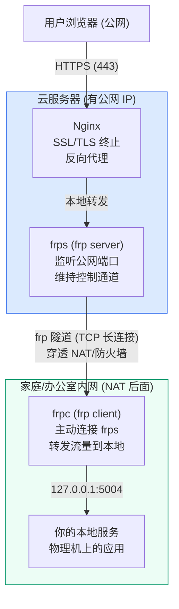
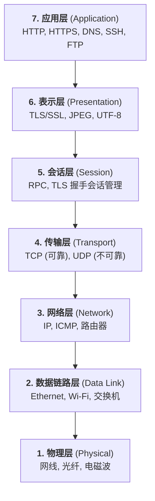
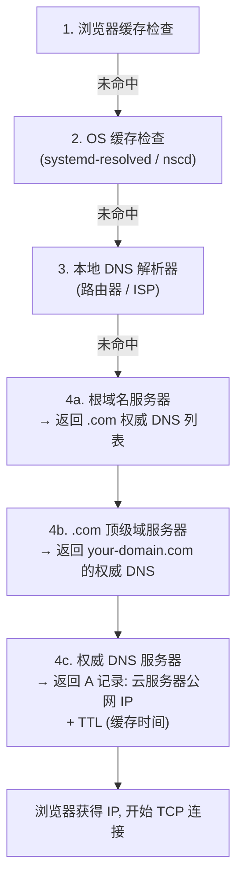
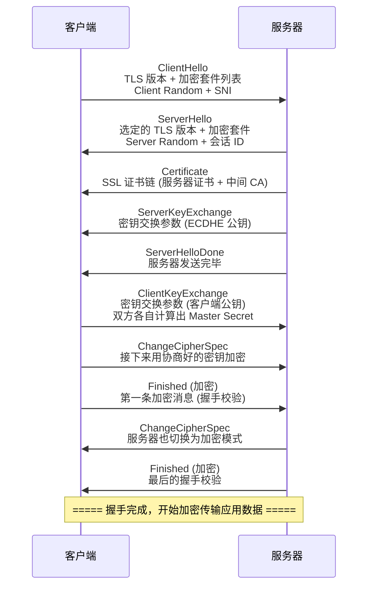
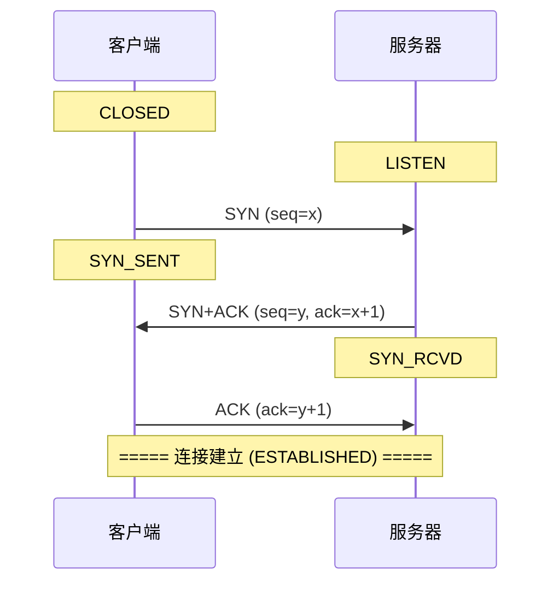
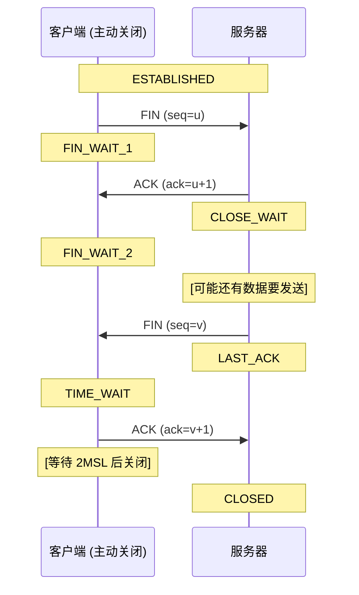
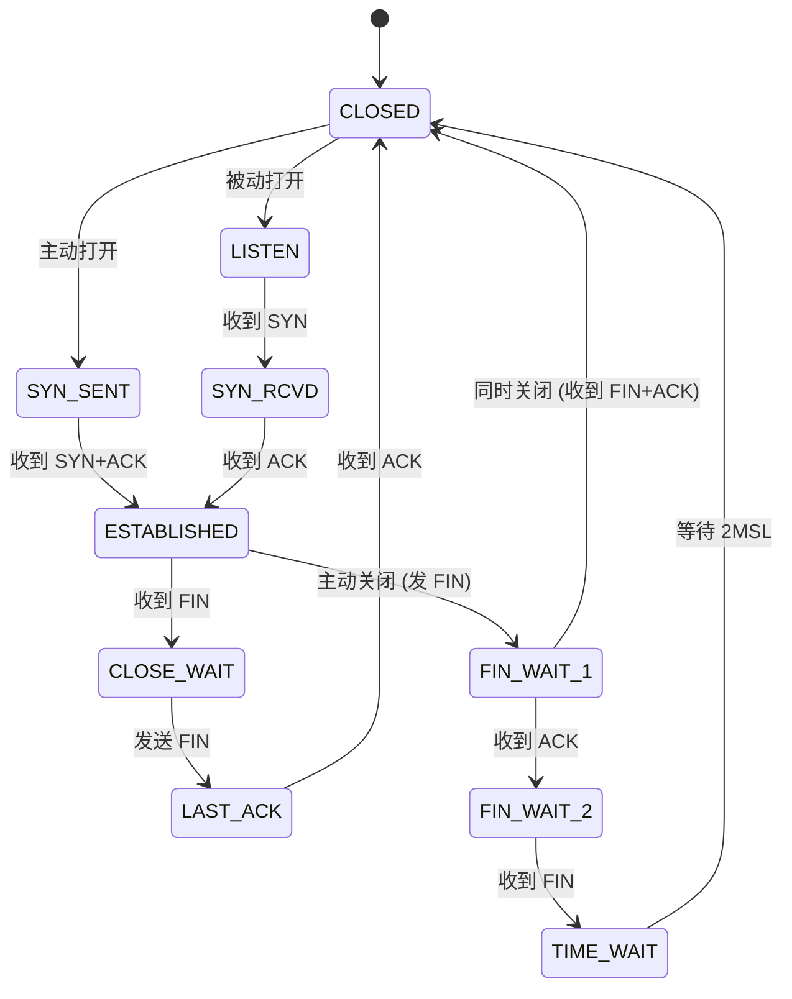

# 内网穿透 + Nginx HTTPS 网络知识详解

## 你的架构总览



---

## 一、网络分层：OSI 七层模型与 TCP/IP 四层模型

在深入具体技术之前，先建立网络分层的全局视角。理解分层是掌握一切网络知识的基础——你架构中的每个组件（frp、Nginx、TLS）都可以在分层模型中找到自己的位置。

### 1.1 OSI 七层模型

OSI（Open Systems Interconnection）模型将网络通信分为七层，每一层为上一层提供服务，同时使用下一层的服务：



### 1.2 TCP/IP 四层模型

现实中互联网使用的是更简洁的 TCP/IP 模型：

```
┌──────────────────┬──────────────────┬───────────────────────────────┐
│  TCP/IP 模型      │  对应 OSI 层      │  你的架构中的对应               │
├──────────────────┼──────────────────┼───────────────────────────────┤
│  应用层           │  7, 6, 5         │  Nginx, frps/frpc, 你的应用    │
│  Application     │                  │  HTTP, TLS, DNS               │
├──────────────────┼──────────────────┼───────────────────────────────┤
│  传输层           │  4               │  TCP (frp隧道, HTTP连接)       │
│  Transport       │                  │                                │
├──────────────────┼──────────────────┼───────────────────────────────┤
│  网络层           │  3               │  IP (公网IP寻址, NAT转换)      │
│  Internet        │                  │                                │
├──────────────────┼──────────────────┼───────────────────────────────┤
│  网络接口层        │  2, 1            │  Ethernet, Wi-Fi              │
│  Network Access  │                  │                                │
└──────────────────┴──────────────────┴───────────────────────────────┘
```

### 1.3 数据封装：逐层打包的过程

当你的应用发送数据时，数据在每一层被"封装"——加上该层的头部信息：

```
发送端（你的物理机）逐层封装：

应用层:    [HTTP 请求数据]
             ↓ 加上 TCP 头
传输层:    [TCP头 | HTTP 请求数据]
             ↓ 加上 IP 头
网络层:    [IP头 | TCP头 | HTTP 请求数据]
             ↓ 加上 Ethernet 头 + 尾
链路层:    [Eth头 | IP头 | TCP头 | HTTP 请求数据 | Eth尾]

接收端（用户浏览器）逐层解封装：反过来一层层剥掉头部
```

每一层只关心自己的职责：IP 层只负责把包送到目标 IP，不关心包里是 TCP 还是 UDP；TCP 层只负责可靠传输，不关心传输的是 HTTP 还是其他协议。这种**分层隔离**是网络设计的核心思想。

### 1.4 在你的架构中追踪一个数据包

```
你的应用 (端口5003)
  │  发送 HTTP 响应（应用层数据）
  ▼
TCP 协议栈
  │  将数据分段，加上 TCP 头（源端口5003, 目标端口xxxxx）
  ▼
IP 协议栈
  │  加上 IP 头（源IP: 192.168.1.100, 目标IP: 用户公网IP）
  ▼
路由器 (NAT)
  │  改写源IP为公网IP，记录映射表
  ▼
frp 隧道 (TCP 连接内)
  │  数据作为 TCP  payload，在 frpc→frps 的 TCP 连接中传输
  │  这实际上是"TCP over TCP"——应用数据在一条已有的TCP连接中传输
  ▼
云服务器
  │  frps 收到数据，交给 Nginx
  ▼
Nginx
  │  读取 HTTP 响应，可选修改 header
  ▼
TLS 层
  │  加密整个 HTTP 响应
  ▼
TCP → IP → 物理网络 → 用户浏览器
```

---

## 二、基础概念：为什么需要内网穿透

### 2.1 公网 IP vs 私有 IP

互联网上的每一台设备都需要一个 IP 地址才能通信。但 IPv4 地址只有约 43 亿个（2³²），远远不够分配给全球所有设备。

**私有 IP 地址段（RFC 1918）：**

| 地址范围 | 子网掩码 | 可用地址数 | 典型用途 |
|---------|---------|-----------|---------|
| 10.0.0.0 ~ 10.255.255.255 | 255.0.0.0 (/8) | 约 1677 万 | 大型企业网 |
| 172.16.0.0 ~ 172.31.255.255 | 255.240.0.0 (/12) | 约 104 万 | 中型网络 |
| 192.168.0.0 ~ 192.168.255.255 | 255.255.0.0 (/16) | 约 6.5 万 | 家庭/小型网络 |

这三个地址段内的 IP 在互联网路由器上**不会被路由**——如果一个路由器收到目标为 192.168.1.100 的数据包，它会直接丢弃。这就是为什么你的物理机拥有私有 IP 时，外网无法直接访问它。

### 2.2 IP 地址与子网掩码

IP 地址本质上是一个 32 位二进制数，通常写成四段十进制（`192.168.1.100`）。子网掩码决定了 IP 地址中哪部分是"网络号"，哪部分是"主机号"：

```
IP:   192.168.1.100  →  11000000.10101000.00000001.01100100
掩码: 255.255.255.0  →  11111111.11111111.11111111.00000000
                          └───── 网络号 ─────┘ └─ 主机号 ─┘

网络号: 192.168.1.0    （同一子网内的所有设备共享）
主机号: 0.0.0.100      （该子网内唯一）
```

CIDR（无类别域间路由）记法：`192.168.1.100/24` 表示前 24 位是网络号。你的云服务器通常有一个 `/32` 的公网 IP（单个地址）。

**为什么理解这个很重要？** 当数据包从互联网到达你的云服务器时，IP 层的路由决策正是基于目标 IP 的网络号来决定"下一跳"往哪走。

### 2.3 NAT（网络地址转换）深入

NAT 有几种不同的实现方式，理解它们的区别对 frp 的运作至关重要：

#### 2.3.1 锥形 NAT（Cone NAT）

```
完全锥形 NAT (Full Cone):
  内网 192.168.1.100:5000 映射为 公网IP:8000
  任何外网主机发送数据到 公网IP:8000 都会被转发到 192.168.1.100:5000
  → frp 在这类 NAT 下最容易工作

限制锥形 NAT (Restricted Cone):
  只有 192.168.1.100 曾经发过数据的目标IP，才能通过 公网IP:8000 发回来
  但端口不限

端口限制锥形 NAT (Port Restricted Cone):
  只有 192.168.1.100 曾经发过数据的目标IP:端口，才能发回来
  → 大多数家庭路由器使用这种
```

#### 2.3.2 对称 NAT（Symmetric NAT）

```
对称 NAT:
  内网 192.168.1.100:5000 访问 服务器A → 映射为 公网IP:8000
  内网 192.168.1.100:5000 访问 服务器B → 映射为 公网IP:8001
  每个(源IP:端口, 目标IP:端口)对使用不同的映射

  → 对 frp 来说，只要 frpc 主动连接同一个 frps，映射关系就保持稳定
  → 但在 P2P 场景下很麻烦（两个对称NAT后的设备很难直连）
```

#### 2.3.3 NAT 转换表

你家路由器内部维护一张表，记录了所有"活跃"的 NAT 映射：

```
内网地址:端口         公网地址:端口        目标地址:端口        状态
192.168.1.100:54321  公网IP:35421       frpsIP:7000        ESTABLISHED
192.168.1.100:54322  公网IP:35422       网站A:443           TIME_WAIT
...
```

**关键点**：当 frpc 与 frps 之间的 TCP 连接保持活跃时，NAT 表中始终有对应的映射条目。如果连接长时间空闲，路由器可能清理掉这条映射（通常是几分钟到几小时），这就是为什么 frp 需要**心跳机制**来维持 NAT 映射。

### 2.4 IPv4 地址枯竭与 NAT 的诞生

NAT 最初并不是为"安全"设计的——它是一个应对 IPv4 地址枯竭的权宜之计：

- **1990年代**：互联网爆发增长，43 亿个 IPv4 地址显然不够用
- **NAT 的解决方案**：让整个家庭/公司共享一个公网 IP，内部用私有 IP
- **NAT 的副作用**：外部无法主动连接内部设备——这在当时被认为是"安全特性"
- **IPv6 的愿景**：每个设备都有公网 IP，理论上不再需要 NAT

但实际上 IPv6 的普及非常缓慢，目前我们仍大量依赖 NAT。frp 这类工具正是在 IPv4+NAT 的现实下诞生的。

### 2.5 端口

端口是传输层（TCP/UDP）用来区分不同应用的 16 位标识符，范围 0-65535：

| 范围 | 类型 | 说明 |
|------|------|------|
| 0-1023 | 知名端口（Well-known） | HTTP=80, HTTPS=443, SSH=22, DNS=53 |
| 1024-49151 | 注册端口（Registered） | 需要向 IANA 注册，如 MySQL=3306, Redis=6379 |
| 49152-65535 | 动态/私有端口（Ephemeral） | 操作系统临时分配给客户端连接 |

当你运行一个 Web 服务监听 `0.0.0.0:5003` 时：
- `0.0.0.0` 表示绑定到本机所有网络接口（127.0.0.1 + 192.168.1.100）
- `5003` 是端口号
- 只有 root 可以绑定 0-1023 端口（这就是为什么 Nginx 通常用 root 启动，然后切换到普通用户）

**客户端端口 vs 服务端端口**：当浏览器访问你的网站时，操作系统会为这个连接随机分配一个临时端口（如 52134），所以一个浏览器可以同时打开几十个到你网站的连接，每个用不同的源端口。

---

## 三、DNS：从域名到 IP 的旅程

DNS（Domain Name System）是互联网的电话簿。没有它，你只能记住 `123.45.67.89` 而不是 `your-domain.com`。

### 3.1 域名的层级结构

```
https://www.example.com

顶级域 (TLD):  .com
二级域:        example
三级域(子域):  www
```

域名的解析是**从右向左**逐级进行的：先找到管理 `.com` 的服务器，再在 `.com` 里找到 `example`，再在 `example` 里找到 `www`。

### 3.2 递归解析过程

当你在浏览器中输入 `https://your-domain.com` 时，DNS 解析的完整流程：



### 3.3 DNS 记录类型

| 类型 | 全称 | 用途 | 示例 |
|------|------|------|------|
| A | Address | 域名 → IPv4 地址 | `your-domain.com → 123.45.67.89` |
| AAAA | Quad-A | 域名 → IPv6 地址 | `your-domain.com → 2001:db8::1` |
| CNAME | Canonical Name | 域名别名 | `www.your-domain.com → your-domain.com` |
| MX | Mail Exchange | 邮件服务器 | `your-domain.com → mail.your-domain.com` |
| TXT | Text | 文本记录（验证、SPF等） | Let's Encrypt 验证时会用到 |
| NS | Name Server | 指定权威 DNS 服务器 | `your-domain.com → ns1.dnspod.cn` |
| SRV | Service | 指定服务的主机和端口 | 非 Web 服务常用 |

**你的场景**：你至少需要一条 A 记录，将你的域名指向云服务器的公网 IP。如果你使用 Let's Encrypt 的 DNS-01 挑战，你还需要添加一条 TXT 记录来证明你拥有该域名。

### 3.4 DNS 与 CDN

一些大型网站使用 DNS 来实现流量调度（GSLB，全局负载均衡）：

- 北京的用户查询 DNS → 返回北京机房的 IP
- 上海的用户查询 DNS → 返回上海机房的 IP

你当前的架构不涉及 CDN，但如果未来要优化全球访问速度，可以在云服务器前面加一层 CDN（如 Cloudflare），让静态资源缓存在边缘节点。

### 3.5 在你的架构中 DNS 的作用

```
用户输入 https://your-domain.com
  → DNS 解析 your-domain.com
  → 得到云服务器公网IP
  → TCP 连接云服务器IP:443
  → TLS 握手（SNI 字段 = your-domain.com）
  → Nginx 根据 server_name 选择正确的 server 块
  → 反向代理到 frps
  → frp 隧道到你的物理机
```

DNS 在整个链路中只做一件事：**把域名变成 IP 地址**。一旦 IP 到手，DNS 就退场了，后续全由 TCP/TLS/HTTP 完成。

---

## 四、frp 内网穿透原理深度解析

### 4.1 角色分工

| 角色 | 运行位置 | 职责 |
|------|---------|------|
| frps (server) | 云服务器（有公网IP） | 监听公网端口，接收外部请求 |
| frpc (client) | 你的物理机（内网） | 主动连接 frps，建立隧道，转发流量 |

### 4.2 为什么 frpc 主动连接就能穿透 NAT？

这是 frp 最关键的设计。回顾 NAT 的特性：**NAT 允许内网主动发起连接**。

frpc 运行在你的内网物理机上，它主动向云服务器上的 frps 发起一个 TCP 连接，这个连接会被 NAT 记录在转换表中。一旦连接建立，这条 TCP 连接就是**全双工**的——数据可以双向流动。frps 可以通过这条通道把外部请求"推"给 frpc。

这就是"反向代理"中"反向"的含义：不是代理服务器去连接后端，而是后端主动来连接代理服务器，建立持久通道。

### 4.3 控制通道与数据通道

```
控制通道（Control Channel）
  - frpc 启动时建立的一条 TCP 长连接
  - 传输 JSON/Protobuf 格式的控制消息
  - 消息类型：登录认证、心跳、新连接通知、代理注册等
  - 始终存在，是 frp 服务的生命线

数据通道（Data Channel）
  - 每个用户请求到来时动态创建
  - 用于传输实际的 HTTP/TCP 数据
  - 可以复用已有的 frpc-frps 连接，也可以创建新连接
  - 请求结束即可关闭
```

### 4.4 frp 隧道中的"TCP over TCP"问题

frp 的隧道本质上是 TCP over TCP——应用层的 HTTP（基于 TCP）在 frp 的 TCP 隧道中传输。这带来了一个微妙的性能问题：

```
常规 TCP 连接:
  客户端 ←──── TCP 重传、拥塞控制 ────→ 服务器
  （一层 TCP 控制机制）

TCP over TCP:
  客户端 ←── 内层 TCP 重传 ──→ ←── 外层 TCP 重传 ──→ 服务器
  （两层 TCP 控制机制互相干扰）
```

**问题**：当网络丢包时，内层 TCP 和外层 TCP 都会触发重传，导致：
- 不必要的重传（内外层都在重传同样的数据）
- 重传超时叠加（内层超时 + 外层超时）
- 拥塞控制叠加（两层都在降速）

**frp 的缓解措施**：
- 对于 HTTP 流量，fps 和 frpc 通常不重新建立 TCP 连接，而是复用已建立的连接池
- 可以启用 frp 的压缩功能（`use_compression = true`）减少数据量
- 可以启用加密（`use_encryption = true`）在隧道层提供安全

### 4.5 frp 心跳机制

frpc 定期（默认每 30 秒）向 frps 发送心跳包。这有两个目的：

1. **检测连接存活**：如果心跳超时（默认 90 秒无响应），frpc 认为连接断开，触发自动重连
2. **维持 NAT 映射**：路由器中的 NAT 映射有超时时间（通常 1-30 分钟）。心跳包确保映射条目始终"活跃"，不被清理

```
时间轴:
  t=0s   frpc 启动，连接 frps
  t=30s  发送心跳
  t=60s  发送心跳
  t=90s  发送心跳
  ...
  t=300s 路由器 NAT 表项如果 5 分钟无活动就会被清理
         但心跳包每 30s 一次，所以映射一直保持
```

### 4.6 一个请求的完整流转

当用户访问 `https://your-domain.com` 时，数据包的旅程如下：

```
步骤1: 用户浏览器发起 HTTPS 请求
  → DNS 解析 your-domain.com → 云服务器公网IP
  → TCP 三次握手连接云服务器IP:443
  → TLS 握手

步骤2: Nginx 接收请求
  → 终止 TLS，解密出 HTTP 请求
  → 根据配置的反向代理规则，将请求转发到本地 frps 监听的端口
    （例如 proxy_pass http://127.0.0.1:8080）

步骤3: frps 收到请求
  → 识别这个请求对应哪个 frpc（通过端口或域名区分）
  → 通过已有的控制通道通知 frpc："有新连接来了"
  → 在 frps 和 frpc 之间建立一条数据通道

步骤4: frpc 收到转发
  → 连接本地的 127.0.0.1:5003
  → 把请求数据原封不动地传给本地服务

步骤5: 本地服务处理请求
  → 你的应用处理业务逻辑
  → 生成响应，返回给 frpc

步骤6: 响应原路返回
  → frpc → [隧道] → frps → Nginx → TLS加密 → 用户浏览器
```

### 4.7 frp 工作模式

frp 支持多种代理类型，你的场景使用的是 TCP 代理模式：

| 代理类型 | 说明 | 适用场景 |
|---------|------|---------|
| tcp | TCP 端口转发 | Web 服务、数据库等 |
| udp | UDP 端口转发 | DNS、游戏服务器等 |
| http | HTTP 代理（可修改 Host 头） | Web 服务，支持虚拟主机 |
| https | HTTPS 代理（端到端加密） | 需要后端自己处理 TLS |
| stcp | Secret TCP（加密的 TCP） | 安全的点对点通信 |
| xtcp | P2P 直连模式 | 两个内网设备直接通信 |

**你的架构用的是 TCP 模式**（因为 Nginx 已经在前面处理了 TLS），或者 HTTP 模式（如果 frps 需要根据域名路由到不同的 frpc）。

---

## 五、Nginx 与 HTTPS 深度解析

### 5.1 TLS/SSL 握手全过程

TLS（Transport Layer Security）的前身是 SSL（Secure Sockets Layer）。目前广泛使用的是 TLS 1.2 和 TLS 1.3。下面是 TLS 1.2 的完整握手过程：



### 5.2 加密套件（Cipher Suite）详解

一个典型的加密套件名如 `TLS_ECDHE_RSA_WITH_AES_128_GCM_SHA256`，它包含了四个算法：

```
TLS_ECDHE_RSA_WITH_AES_128_GCM_SHA256
    │      │        │          │
    │      │        │          └─ 哈希算法 (SHA-256)
    │      │        │             用于 HMAC 消息认证
    │      │        │
    │      │        └─ 对称加密算法 (AES-128-GCM)
    │      │           用于加密实际传输的数据
    │      │           GCM 模式同时提供加密和认证（AEAD）
    │      │
    │      └─ 身份认证算法 (RSA)
    │         服务器用 RSA 私钥签名，客户端用证书中的公钥验证
    │
    └─ 密钥交换算法 (ECDHE)
       在不安全的通道上协商出一个共享密钥
```

**为什么需要非对称加密 + 对称加密的组合？**

- **非对称加密（RSA/ECDHE）**：慢，但安全，用于握手阶段交换密钥，不需要双方预先共享秘密
- **对称加密（AES-128-GCM）**：快，用于传输大量数据

TLS 的精妙之处在于：用慢但安全的非对称加密来协商一个临时的对称密钥，然后用快的对称加密来传输实际数据。

### 5.3 证书链与信任模型

```
根 CA 证书（Root CA）
  │  Let's Encrypt 的根证书
  │  预装在操作系统/浏览器中
  │  自签名，绝对信任
  ▼
中间 CA 证书（Intermediate CA）
  │  Let's Encrypt 的中间证书（如 R3）
  │  由根 CA 签名
  ▼
服务器证书（Leaf Certificate）
  your-domain.com 的证书
  由中间 CA 签名
```

**验证过程**：
1. 浏览器用预装的根 CA 证书验证中间 CA 证书的签名
2. 用中间 CA 证书验证服务器证书的签名
3. 检查服务器证书中的域名（CN 或 SAN）是否匹配你访问的域名
4. 检查证书是否在有效期内
5. 检查证书是否被吊销（OCSP）

**Let's Encrypt 的角色**：它是一个免费的 CA（Certificate Authority），使用 ACME 协议自动化证书申请和验证过程。

### 5.4 SNI（Server Name Indication）

如果一个 Nginx 要服务多个域名，它怎么知道用哪个证书？

SNI 是 TLS 协议的扩展，在 TLS 握手的**第一个包（ClientHello）**中，客户端就会告诉服务器："我要访问的域名是 your-domain.com"。服务器根据这个信息选择对应的 SSL 证书。

**没有 SNI 的时代（一个 IP 一个证书）：**
```
123.45.67.89 → siteA.com 的证书
123.45.67.90 → siteB.com 的证书  （需要多个公网IP！）
```

**有了 SNI 之后（一个 IP 多个证书）：**
```
123.45.67.89 + SNI: siteA.com → siteA.com 的证书
123.45.67.89 + SNI: siteB.com → siteB.com 的证书
```

这正是你的云服务器可以同时服务多个 HTTPS 网站的基础。

### 5.5 反向代理（Reverse Proxy）

Nginx 在这里扮演反向代理的角色：

```
正向代理：
  客户端A ─┐
  客户端B ─┼→ 代理服务器 → 互联网上的各种目标
  客户端C ─┘
  （客户端配置代理，通过代理访问外网）

反向代理：
  客户端们 → 一个入口（Nginx）→ 后端A (frps)
                               → 后端B (另一个服务)
                               → 后端C
  （客户端不知道后端的存在，以为 Nginx 就是服务端）
```

Nginx 作为反向代理的关键配置：

```nginx
server {
    listen 443 ssl http2;
    server_name your-domain.com;

    ssl_certificate     /path/to/fullchain.pem;
    ssl_certificate_key /path/to/privkey.pem;

    # 推荐的 TLS 安全配置
    ssl_protocols TLSv1.2 TLSv1.3;
    ssl_ciphers ECDHE-ECDSA-AES128-GCM-SHA256:ECDHE-RSA-AES128-GCM-SHA256;
    ssl_prefer_server_ciphers on;

    location / {
        proxy_pass http://127.0.0.1:8080;
        proxy_set_header Host $host;
        proxy_set_header X-Real-IP $remote_addr;
        proxy_set_header X-Forwarded-For $proxy_add_x_forwarded_for;
        proxy_set_header X-Forwarded-Proto $scheme;

        # WebSocket 支持（如果你的应用需要）
        proxy_http_version 1.1;
        proxy_set_header Upgrade $http_upgrade;
        proxy_set_header Connection "upgrade";
    }
}
```

**关键 header 说明：**

| Header | 含义 | 示例值 |
|--------|------|--------|
| X-Real-IP | 真实客户端 IP | `203.0.113.5` |
| X-Forwarded-For | 代理链（逗号分隔） | `203.0.113.5, 10.0.0.1` |
| X-Forwarded-Proto | 原始协议 | `https` |
| Host | 原始请求的域名 | `your-domain.com` |

没有这些 header，你的本地服务看到的请求来源永远是 `127.0.0.1`（frpc 的地址），也不知道用户用的是 https 还是 http。

### 5.6 SSL/TLS 终止的含义

```
客户端 ←── TLS 加密 ──→ Nginx ←── 明文 HTTP ──→ frps ←── 隧道 ──→ 本地服务
       (公网不安全)        (本机通信)            (frp自带加密可选)
```

TLS 终止的好处：
- **后端服务不需要处理 TLS**，降低后端复杂度和性能开销
- **证书集中管理**，只在 Nginx 上配置一次
- **Nginx 可以检查和修改 HTTP 内容**（加 header、做缓存、WAF 等）
- **性能**：Nginx 的 TLS 实现经过高度优化，比大多数应用自己处理快

TLS 终止的代价：
- **Nginx 到后端是明文**：在你的场景中这不是问题，因为 Nginx → frps 是同一台机器的本地连接（127.0.0.1），frps → frpc 在公网上但 frp 可以开启自带加密

### 5.7 Let's Encrypt 与 ACME 协议

如果你用的是 Let's Encrypt 免费证书，背后是 ACME（Automatic Certificate Management Environment）协议：

```
1. ACME 客户端（如 certbot）向 Let's Encrypt 申请证书
   POST https://acme-v02.api.letsencrypt.org/acme/new-order

2. Let's Encrypt 发起挑战（Challenge）验证你拥有该域名

   HTTP-01 挑战：
     Let's Encrypt 说："在 http://your-domain.com/.well-known/acme-challenge/xxxxx
     放一个指定的文件"
     certbot 在 Nginx 能访问到的目录下创建该文件
     Let's Encrypt 访问验证

   DNS-01 挑战（推荐用这个，不需要开放 80 端口）：
     Let's Encrypt 说："在 your-domain.com 的 DNS 中添加一条 TXT 记录，
     值为指定的 token"
     你（或自动化脚本）在 DNS 管理后台添加 TXT 记录
     Let's Encrypt 查询 DNS 验证

3. 验证通过后颁发证书（有效期 90 天）

4. certbot 自动续期（到期前 30 天尝试续期）
   通常配置为 cron job: 0 3 * * * certbot renew --quiet
```

---

## 六、TCP 深度解析：互联网的基石

TCP（Transmission Control Protocol）是你整个架构的传输层基础——浏览器到 Nginx、Nginx 到 frps、frps 到 frpc、frpc 到你的应用，所有连接都基于 TCP。

### 6.1 TCP 的核心特性

| 特性 | 实现方式 | 意义 |
|------|---------|------|
| 面向连接 | 三次握手建立连接 | 双方确认彼此可达，协商初始参数 |
| 可靠传输 | 序列号 + 确认 + 重传 | 保证数据不丢、不重、不乱序 |
| 流量控制 | 滑动窗口 | 防止发送方压垮接收方 |
| 拥塞控制 | 慢启动 + 拥塞避免 | 防止网络被过度使用 |
| 全双工 | 独立序列号空间 | 双向可以同时收发 |
| 字节流 | 无消息边界 | 需要上层协议（如 HTTP）来界定消息 |

### 6.2 TCP 报文段结构

```
TCP 报文段头部（20-60 字节）：

 0                   1                   2                   3
 0 1 2 3 4 5 6 7 8 9 0 1 2 3 4 5 6 7 8 9 0 1 2 3 4 5 6 7 8 9 0 1
+-+-+-+-+-+-+-+-+-+-+-+-+-+-+-+-+-+-+-+-+-+-+-+-+-+-+-+-+-+-+-+-+
|          源端口 (16位)         |         目标端口 (16位)         |
+-+-+-+-+-+-+-+-+-+-+-+-+-+-+-+-+-+-+-+-+-+-+-+-+-+-+-+-+-+-+-+-+
|                        序列号 (32位)                            |
+-+-+-+-+-+-+-+-+-+-+-+-+-+-+-+-+-+-+-+-+-+-+-+-+-+-+-+-+-+-+-+-+
|                       确认号 (32位)                             |
+-+-+-+-+-+-+-+-+-+-+-+-+-+-+-+-+-+-+-+-+-+-+-+-+-+-+-+-+-+-+-+-+
| 数据偏移 | 保留  |U|A|P|R|S|F|         窗口大小 (16位)           |
|  (4位)   | (6位) |R|C|S|S|Y|I|                                |
|          |       |G|K|H|T|N|N|                                |
+-+-+-+-+-+-+-+-+-+-+-+-+-+-+-+-+-+-+-+-+-+-+-+-+-+-+-+-+-+-+-+-+
|          校验和 (16位)          |        紧急指针 (16位)          |
+-+-+-+-+-+-+-+-+-+-+-+-+-+-+-+-+-+-+-+-+-+-+-+-+-+-+-+-+-+-+-+-+
|                    选项 (0-40字节，可变)                         |
+-+-+-+-+-+-+-+-+-+-+-+-+-+-+-+-+-+-+-+-+-+-+-+-+-+-+-+-+-+-+-+-+
|                        数据 (payload)                           |
+-+-+-+-+-+-+-+-+-+-+-+-+-+-+-+-+-+-+-+-+-+-+-+-+-+-+-+-+-+-+-+-+
```

关键标志位（6 个）：
- **SYN**：建立连接
- **ACK**：确认（除了第一个 SYN 包，所有包都带 ACK）
- **FIN**：结束连接
- **RST**：重置连接（异常断开）
- **PSH**：催促接收方尽快交给应用层
- **URG**：紧急数据

### 6.3 三次握手（连接建立）

为什么是三次而不是两次？因为网络可能延迟、重传旧的数据包，三次握手能防止历史连接被错误建立。



**序列号（Sequence Number）的作用**：

每个字节的数据都有一个序列号。序列号在握手时随机初始化（防止历史连接干扰），之后每发一个字节就递增。接收方用确认号告诉发送方："我收到了序列号 N 之前的所有数据，下一个请发 N"。

**为什么初始序列号要随机？**
假设不随机，总是从 0 开始。如果客户端和服务器之间有一个旧连接的数据包在网络中滞留了很久，当新连接建立后，这个旧数据包到达服务器，序列号刚好匹配，就会被当作有效数据接收。随机初始序列号让这种概率极低。

### 6.4 四次挥手（连接关闭）

为什么是四次？因为 TCP 是全双工的——每个方向都需要独立关闭。



**TIME_WAIT 状态（2MSL ≈ 2分钟）**：

主动关闭的一方（通常是客户端）会在 TIME_WAIT 状态等待 2 倍 MSL（Maximum Segment Lifetime，最大报文生存时间，典型值 30 秒）。

为什么需要 TIME_WAIT？
- **确保最后一个 ACK 到达**：如果这个 ACK 丢了，服务器会重发 FIN，客户端需要在 TIME_WAIT 状态响应它
- **让旧连接的数据包消散**：防止旧连接的数据包被新连接误收

**在你的架构中**：Nginx 作为反向代理时，通常由 Nginx 主动关闭与上游（frps）的连接。如果连接频繁创建和关闭，Nginx 端可能积累大量 TIME_WAIT 连接。这就是为什么 Nginx 使用连接池复用（keepalive）很重要。

### 6.5 滑动窗口与流量控制

接收方通过"窗口大小"字段告诉发送方："我的缓冲区还剩多少空间，你最多可以连续发这么多字节，不用等确认。"

```
发送方                              接收方
  │                                   │
  │── seq=1, 数据(1000字节) ──────────→│
  │── seq=1001, 数据(1000字节) ───────→│
  │── seq=2001, 数据(1000字节) ───────→│  （连续发送，不用等确认）
  │── seq=3001, 数据(1000字节) ───────→│  接收缓冲区：还剩 4KB
  │                                   │
  │←── ack=2001, win=4096 ────────────│  确认前2000字节，还有4KB空间
  │                                   │
  │── seq=4001, 数据(1000字节) ───────→│  继续发送...
  │── seq=5001, 数据(1000字节) ───────→│
```

**如果窗口变成 0**：发送方停止发送，进入"零窗口探测"模式——定期发送探测包询问接收方是否恢复了空间。

### 6.6 拥塞控制

流量控制是保护接收方，拥塞控制是保护**网络本身**——防止过多数据注入网络导致路由器缓冲区溢出。

TCP 的拥塞控制有四个核心算法：

```
1. 慢启动（Slow Start）
   连接建立后，拥塞窗口(cwnd)从 1 个 MSS 开始
   每收到一个 ACK，cwnd 翻倍（指数增长）
   直到达到慢启动阈值(ssthresh)或发生丢包

2. 拥塞避免（Congestion Avoidance）
   cwnd 达到 ssthresh 后，转为线性增长
   每个 RTT，cwnd 增加 1 个 MSS
   （不再是翻倍）

3. 快速重传（Fast Retransmit）
   如果发送方连续收到 3 个重复的 ACK
   不等超时，立即重传丢失的包

4. 快速恢复（Fast Recovery）
   快速重传后，不进入慢启动
   而是将 ssthresh 设为 cwnd/2，cwnd 设为 ssthresh
   然后进入拥塞避免
```

**在你的 frp 隧道中**：TCP over TCP 的双层拥塞控制可能导致过度降速。如果外层 TCP（frp 隧道）检测到丢包并降速，内层 TCP 也可能同时检测到"丢包"（其实是外层降速导致的延迟增加）并进一步降速。这就是所谓的"TCP 熔断"效应。

### 6.7 TCP Keepalive

TCP 本身提供了 Keepalive 机制，但它和 frp 的心跳是不同的层面：

| 层面 | 机制 | 默认间隔 | 目的 |
|------|------|---------|------|
| TCP Keepalive | 操作系统内核 | 2 小时（Linux 默认） | 检测对端是否存活 |
| frp 心跳 | 应用层 | 30 秒 | 检测隧道是否存活 + 维持 NAT 映射 |

frp 不能依赖 TCP Keepalive，因为它的间隔太长了（等 2 小时才发现对端死了是不可接受的），而且它无法维持 NAT 映射（NAT 超时可能在几分钟级别）。

### 6.8 TCP 状态转换图速览



---

## 七、HTTP 协议详解

HTTP 是 Web 的基石，运行在 TCP 之上，属于应用层协议。你的 Nginx 在终止 TLS 之后处理的正是 HTTP。

### 7.1 HTTP 请求结构

```
GET /api/users?id=123 HTTP/1.1           ← 请求行：方法 + URL路径 + HTTP版本
Host: your-domain.com                     ← 头部：域名（必选，HTTP/1.1 要求）
User-Agent: Mozilla/5.0 ...              ← 头部：客户端标识
Accept: text/html,application/json       ← 头部：客户端能接受的格式
Accept-Encoding: gzip, deflate, br       ← 头部：客户端支持的压缩
Cookie: session_id=abc123                ← 头部：Cookie
X-Forwarded-For: 203.0.113.5             ← 头部：代理添加的真实IP
                                         ← 空行（头部结束标志）
{"key": "value"}                         ← 可选的请求体（POST/PUT 等）
```

### 7.2 HTTP 响应结构

```
HTTP/1.1 200 OK                          ← 状态行：版本 + 状态码 + 原因短语
Server: nginx/1.24.0                     ← 头部：服务器软件
Content-Type: application/json           ← 头部：响应格式
Content-Length: 1234                     ← 头部：响应体长度
Set-Cookie: session_id=xyz789            ← 头部：设置 Cookie
Cache-Control: no-cache                  ← 头部：缓存策略
                                         ← 空行
{"users": [...]}                         ← 响应体
```

### 7.3 HTTP 方法

| 方法 | 语义 | 幂等性 | 安全 |
|------|------|--------|------|
| GET | 获取资源 | 是 | 是 |
| POST | 创建资源 | 否 | 否 |
| PUT | 完整替换资源 | 是 | 否 |
| PATCH | 部分修改资源 | 否 | 否 |
| DELETE | 删除资源 | 是 | 否 |
| HEAD | 获取头部（无响应体） | 是 | 是 |
| OPTIONS | 查询支持的方法 | 是 | 是 |

**幂等性**：多次执行同样的请求，结果和一次相同。GET、PUT、DELETE 是幂等的。

### 7.4 常见状态码

```
2xx: 成功
  200 OK              - 请求成功
  201 Created         - 资源已创建（POST 成功）
  204 No Content      - 成功但无返回内容（DELETE 成功）

3xx: 重定向
  301 Moved Permanently - 永久重定向（浏览器会缓存，建议用 308）
  302 Found           - 临时重定向（历史原因，语义不精确）
  304 Not Modified    - 资源未修改（缓存验证）
  307 Temporary Redirect - 临时重定向，不改变方法
  308 Permanent Redirect - 永久重定向，不改变方法

4xx: 客户端错误
  400 Bad Request     - 请求格式错误
  401 Unauthorized    - 需要认证
  403 Forbidden       - 已认证但无权限
  404 Not Found       - 资源不存在
  405 Method Not Allowed - 方法不允许
  429 Too Many Requests - 请求过于频繁（限流）

5xx: 服务端错误
  500 Internal Server Error - 服务器内部错误
  502 Bad Gateway     - 上游服务器返回了无效响应
  503 Service Unavailable - 服务不可用（过载或维护）
  504 Gateway Timeout - 上游服务器响应超时
```

**在你的架构中特别关注的**：
- **502**：Nginx 能连上 frps，但 frps/frpc 返回了无效响应（隧道断了）
- **504**：Nginx 等待 frps 响应超时（可能是隧道延迟太高，或本地服务处理太慢）

### 7.5 HTTP Keep-Alive（持久连接）

HTTP/1.0 默认每个请求建立一个 TCP 连接，用完就关。HTTP/1.1 默认使用持久连接：

```
非持久连接（HTTP/1.0）:
  客户端 ──TCP握手──→ 服务器
  客户端 ──请求1──→ 服务器
  客户端 ←──响应1── 服务器
  客户端 ──TCP挥手──→ 服务器
  客户端 ──TCP握手──→ 服务器
  客户端 ──请求2──→ 服务器
  ...

持久连接（HTTP/1.1 Keep-Alive）:
  客户端 ──TCP握手──→ 服务器
  客户端 ──请求1──→ 服务器
  客户端 ←──响应1── 服务器
  客户端 ──请求2──→ 服务器   （复用同一个TCP连接）
  客户端 ←──响应2── 服务器
  ...
  客户端 ──TCP挥手──→ 服务器   （空闲一段时间后关闭）
```

**在你的链路中**：用户浏览器 → Nginx 之间使用 HTTP Keep-Alive，Nginx → frps 之间也可以配置 keepalive 连接池：

```nginx
upstream frps_backend {
    server 127.0.0.1:8080;
    keepalive 32;  # 保持 32 个到 frps 的空闲连接
}
```

这避免了为每个请求都创建新的 TCP 连接，减少了 TIME_WAIT 状态和握手开销。

### 7.6 HTTP/2 简介

HTTP/2 不改变 HTTP 的语义（方法、状态码、header 都一样），但改变了传输方式：

| 特性 | HTTP/1.1 | HTTP/2 |
|------|----------|--------|
| 连接复用 | Keep-Alive，但请求串行 | 多路复用（multiplexing），请求并行 |
| 头部压缩 | 无 | HPACK 压缩 |
| 服务器推送 | 不支持 | Server Push（服务器可主动推送资源） |
| 二进制协议 | 文本 | 二进制帧 |
| 队头阻塞 | 有（HTTP 层面） | 大部分解决（但仍受 TCP 队头阻塞影响） |

**Nginx 开启 HTTP/2**：在 `listen 443 ssl` 后加 `http2`：

```nginx
listen 443 ssl http2;
```

### 7.7 HTTP/3 展望

HTTP/3 基于 QUIC（Quick UDP Internet Connections），使用 UDP 而不是 TCP：

```
HTTP/1.1, HTTP/2:  基于 TCP
HTTP/3:            基于 QUIC (UDP)

QUIC 的优势：
  - 0-RTT 握手：之前连接过的服务器可以秒连
  - 无 TCP 队头阻塞：即使一个流丢包，其他流不受影响
  - 连接迁移：从 Wi-Fi 切换到蜂窝网络，连接不断
```

这目前对你的场景影响不大，但了解技术演进方向很有价值。

---

## 八、网络安全基础

### 8.1 HTTPS 防御了什么

| 攻击类型 | 无 HTTPS | 有 HTTPS |
|---------|---------|----------|
| 窃听（被动监听） | 可以读到所有内容 | 只能看到 IP 和域名（SNI） |
| 篡改（中间人修改数据） | 可以注入广告、恶意代码 | 篡改会被检测到（MAC 失败） |
| 冒充（伪造服务器） | 可以伪造任意网站 | 证书验证失败，浏览器警告 |

### 8.2 中间人攻击（MITM）

```
正常连接:
  用户 ←───────── HTTPS ──────────→ your-domain.com (真的有证书)
  数据加密，只有真正的服务器能解密

MITM 攻击:
  用户 ←── HTTPS ──→ 攻击者 ←── HTTP ──→ your-domain.com
  攻击者伪造证书，用户看到的是攻击者的证书
```

**防御**：证书链验证。攻击者无法获得由受信任 CA 签名的 `your-domain.com` 证书（除非 CA 被攻破或你的私钥泄露），所以浏览器会显示证书错误警告。

**什么情况下 HTTPS 也会被攻击？**
- 用户忽略了证书警告
- 攻击者控制了用户设备，安装了恶意根证书
- 你的服务器私钥泄露
- 配置了不安全的加密套件或协议版本（如 TLS 1.0）

### 8.3 frp 链路的安全考量

你的安全性由不同层级保障：

```
公网段（最危险）:
  用户 ←── TLS 加密 ──→ Nginx      ✓ 加密
  Nginx → frps                     ✓ 在本机，127.0.0.1 不经过网络

隧道段（经过公网）:
  frps ←── frp 隧道 ──→ frpc       注意！
  - 如果 frp 未开启加密，数据是明文的 TCP
  - 设置 use_encryption = true 或使用 stcp 模式

内网段（相对安全）:
  frpc → 本地应用:5003             ✓ 在本机
```

**安全建议**：
- Nginx 的 HTTPS 保障了公网段的安全 —— 必须做好
- frp 隧道经过公网，建议开启 `use_encryption = true`
- 如果隧道内的数据是 HTTP（已被 Nginx 解密），开启 frp 加密就很重要
- 或者你可以在 frp 隧道中也传 HTTPS（Nginx 不做 TLS 终止，直接 stream 到后端），但这样本地应用就需要处理 TLS

### 8.4 DDoS 攻击与防护

DDoS（Distributed Denial of Service）是让你的服务无法访问的常见攻击方式：

| 攻击类型 | 攻击目标 | 防护思路 |
|---------|---------|---------|
| SYN Flood | TCP 握手队列 | SYN Cookie, 增加积压队列 |
| HTTP Flood | 应用层 CPU/内存 | 限流、WAF、CDN |
| 带宽耗尽 | 网络带宽 | 上 CDN（如 Cloudflare） |
| DNS 放大 | DNS 服务器 | 限制递归查询 |

**你的架构的脆弱点**：
- 云服务器：被 DDoS 可能导致云服务商封 IP
- frp 隧道：本身是限速的（受限于你家宽带的上传带宽）
- 本地服务：如果请求穿过了所有防护到达你的物理机，物理机的处理能力是有限的

**基础防护**：
- Nginx 配置 `limit_req` 限流
- Cloudflare CDN（免费计划即可）挡在最前面
- 云服务器的安全组/防火墙只开放必要端口

---

## 九、Socket 编程概念介绍

当你编写网络应用时（如你的端口 5003 上的服务），你使用的编程接口叫 Socket。理解 Socket 有助于理解网络通信的底层原理。

### 9.1 什么是 Socket

Socket（套接字）是操作系统提供的网络编程接口，是对 TCP/IP 协议栈的抽象。它把复杂的网络通信封装成类似文件读写的操作。

```
应用层代码（你的 Python/Node.js/Go 程序）
  │
  │  socket(), bind(), listen(), accept(), connect()
  │  send(), recv(), read(), write(), close()
  │
  ▼
操作系统 Socket API
  │
  │  将系统调用转换为 TCP/IP 协议栈操作
  │
  ▼
内核 TCP/IP 协议栈
  │
  │  封装、分段、寻址、路由
  │
  ▼
网卡驱动 → 物理网络
```

### 9.2 服务端 Socket 流程

```
socket()  创建 socket
    ↓
bind()    绑定到 0.0.0.0:5003
    ↓      告诉操作系统："5003 端口的包都是我的"
listen()  开始监听
    ↓      将 socket 从 CLOSED 状态变为 LISTEN 状态
accept()  等待客户端连接（阻塞）
    ↓      三次握手完成后，返回一个新的 socket
    ↓      原 socket 继续监听，新 socket 用于和这个客户端通信
read()    读取客户端发来的数据
    ↓
write()   发送响应
    ↓
close()   关闭连接
```

### 9.3 客户端 Socket 流程

```
socket()  创建 socket
    ↓
connect() 连接服务器 IP:端口
    ↓      触发三次握手机制
write()   发送请求数据
    ↓
read()    读取响应数据
    ↓
close()   关闭连接
```

### 9.4 frp 如何利用 Socket

frps 和 frpc 本质上也是基于 Socket 的程序：

```
frps 端:
  socket() → bind(0.0.0.0:7000) → listen() → accept()
  → 等待 frpc 的连接（控制通道）
  → 等待外部请求的连接（数据通道）

frpc 端:
  socket() → connect(frps_ip:7000)
  → 建立控制通道
  → 收到新连接通知后，socket() → connect(127.0.0.1:5003)
  → 在 frps↔frpc 隧道和 frpc→本地服务 之间双向转发数据
```

### 9.5 关键概念：阻塞 vs 非阻塞 I/O

```
阻塞 I/O:
  data = socket.read()   ← 如果没数据，线程就卡在这里等待

非阻塞 I/O:
  socket.set_nonblocking()
  data = socket.read()   ← 没数据立刻返回，不等待

I/O 多路复用（Nginx 使用的）:
  epoll/kqueue 同时监控成百上千个 socket
  哪个 socket 有数据了，就处理哪个
  一个线程处理所有连接 → 极高的并发能力
```

这就是为什么 Nginx 可以用很少的线程处理几万个并发连接——它使用 epoll（Linux）或 kqueue（BSD/macOS）做 I/O 多路复用。

---

## 十、架构总结与数据流全景

### 10.1 完整数据包路径（从用户到你的应用再返回）

将我们讨论的所有知识串在一起，追踪一个 HTTPS 请求的完整旅程：

```
┌──── 阶段1: 用户端准备 ──────────────────────────────────────────┐
│                                                                  │
│  1. 用户在浏览器输入 https://your-domain.com                      │
│  2. DNS 解析: your-domain.com → 云服务器公网IP (见第三章)          │
│  3. 浏览器生成 TCP SYN 包 → 发送到云服务器IP:443                   │
│                                                                  │
└──────────────────────────────────────────────────────────────────┘
                              ↓
┌──── 阶段2: TLS 握手（云服务器）───────────────────────────────────┐
│                                                                  │
│  4. TCP 三次握手完成 (见6.3)，客户端与 Nginx 建立 TCP 连接          │
│  5. TLS 握手开始 (见5.1):                                        │
│     - ClientHello: 加密套件列表 + SNI="your-domain.com" + 随机数  │
│     - ServerHello: 选定加密套件 + 证书 + 随机数                    │
│     - 密钥交换 (ECDHE) + 证书验证                                  │
│     - 生成会话密钥，后续通信加密                                    │
│  6. TLS 握手完成，Nginx 收到加密的 HTTP 请求                        │
│  7. Nginx 用会话密钥解密 → 得到明文的 HTTP 请求                     │
│                                                                  │
└──────────────────────────────────────────────────────────────────┘
                              ↓
┌──── 阶段3: Nginx 反向代理处理 ───────────────────────────────────┐
│                                                                  │
│  8. Nginx 检查 server_name，匹配正确的 server 块                   │
│  9. Nginx 添加/修改 header:                                      │
│     X-Real-IP: 用户真实IP                                        │
│     X-Forwarded-For: 用户真实IP                                   │
│     X-Forwarded-Proto: https                                     │
│ 10. Nginx 将 HTTP 请求通过 proxy_pass 发送到 127.0.0.1:8080      │
│     (frps 监听的端口)                                             │
│                                                                  │
└──────────────────────────────────────────────────────────────────┘
                              ↓
┌──── 阶段4: frps 接收并转发 ──────────────────────────────────────┐
│                                                                  │
│ 11. frps 在 8080 端口收到来自 Nginx 的 HTTP 请求                   │
│ 12. frps 检查代理配置，识别该请求属于哪个 frpc                     │
│ 13. frps 通过控制通道向 frpc 发送"新连接"通知                      │
│ 14. frps 和 frpc 为该请求建立数据通道                              │
│       (可以复用已建立的连接，也可以新建)                             │
│ 15. frps 将 HTTP 请求通过隧道发送给 frpc                           │
│                                                                  │
└──────────────────────────────────────────────────────────────────┘
                              ↓
┌──── 阶段5: frpc 转发到本地应用 ──────────────────────────────────┐
│                                                                  │
│ 16. frpc 收到隧道中的数据                                          │
│ 17. frpc 创建到 127.0.0.1:5003 的 TCP 连接                        │
│ 18. frpc 将 HTTP 请求发送给本地应用                                │
│ 19. 你的应用处理请求，生成 HTTP 响应                                │
│ 20. frpc 读取响应，通过隧道发回给 frps                             │
│                                                                  │
└──────────────────────────────────────────────────────────────────┘
                              ↓
┌──── 阶段6: 响应返回 ────────────────────────────────────────────┐
│                                                                  │
│ 21. frps 收到响应 → 交给 Nginx                                    │
│ 22. Nginx 可选地修改响应 header                                   │
│ 23. Nginx 用 TLS 会话密钥加密整个 HTTP 响应                        │
│ 24. 加密数据通过 TCP 连接发送给用户                                  │
│ 25. 用户浏览器解密并渲染页面                                        │
│                                                                  │
└──────────────────────────────────────────────────────────────────┘
```

### 10.2 各层的安全边界

```
┌────────────────────────────────────────────────────────┐
│  公网 (不可信)                                          │
│  用户 ←──────── HTTPS (TLS 1.2+) ──────────→ 云服务器   │
│  数据被加密，但域名(SNI)和IP可见                        │
├────────────────────────────────────────────────────────┤
│  云服务器内部 (相对可信)                                 │
│  Nginx → frps (127.0.0.1，不经过物理网络)               │
├────────────────────────────────────────────────────────┤
│  公网隧道 (需加固)                                      │
│  frps ←── frp tunnel (建议开启encryption) ──→ frpc     │
├────────────────────────────────────────────────────────┤
│  本地内网 (可信)                                        │
│  frpc → 你的应用 (127.0.0.1)                           │
└────────────────────────────────────────────────────────┘
```

### 10.3 技术栈分层总结

```
┌─────────────────────────────────────────────┐
│  应用层      │  你的应用 (HTTP)               │
│              │  Nginx (HTTP反向代理)          │
│              │  frps/frpc (隧道控制协议)       │
├─────────────────────────────────────────────┤
│  安全层      │  TLS 1.2/1.3 (加密)           │
│              │  证书链验证 (身份认证)          │
├─────────────────────────────────────────────┤
│  传输层      │  TCP (可靠传输)               │
│              │  端口 (多路分解)               │
├─────────────────────────────────────────────┤
│  网络层      │  IP (寻址与路由)              │
│              │  NAT (地址转换)               │
├─────────────────────────────────────────────┤
│  基础设施    │  DNS (域名解析)               │
│              │  路由器, 交换机, 防火墙         │
└─────────────────────────────────────────────┘
```

---

## 十一、关键网络概念速查表

| 概念 | 一句话解释 | 详细章节 |
|------|-----------|---------|
| OSI 七层模型 | 网络通信的分层架构标准 | 第一章 |
| TCP/IP 四层模型 | 互联网实际使用的分层模型 | 第一章 |
| 数据封装 | 数据在每层加上头部，逐层打包 | 1.3 |
| IP 地址 | 网络层地址，用于在网络中定位一台主机 | 2.1 |
| 子网掩码/CIDR | 区分 IP 中网络号和主机号 | 2.2 |
| NAT | 网络地址转换，允许多个设备共享一个公网IP | 2.3 |
| 锥形 NAT | 内网地址固定映射到一个公网端口 | 2.3.1 |
| 对称 NAT | 每个目标地址使用不同的映射 | 2.3.2 |
| NAT 映射表 | 路由器维护的内外地址对应关系 | 2.3.3 |
| 端口 | 传输层标识，用于区分一台主机上的不同应用 | 2.5 |
| DNS | 域名系统，把域名翻译成IP地址 | 第三章 |
| A/AAAA 记录 | 域名到 IPv4/IPv6 的映射 | 3.3 |
| CNAME 记录 | 域名别名 | 3.3 |
| 递归查询 | DNS 解析器代替客户端完成完整查询 | 3.2 |
| TCP | 面向连接的可靠传输协议 | 第六章 |
| 三次握手 | TCP 连接建立过程（SYN, SYN+ACK, ACK） | 6.3 |
| 四次挥手 | TCP 连接关闭过程（FIN, ACK, FIN, ACK） | 6.4 |
| TIME_WAIT | 主动关闭方等待 2MSL 的状态 | 6.4 |
| 序列号/确认号 | TCP 实现可靠传输的核心机制 | 6.3 |
| 滑动窗口 | TCP 流量控制机制 | 6.5 |
| 拥塞控制 | TCP 防止网络过载的机制 | 6.6 |
| TCP Keepalive | 操作系统级的连接存活检测 | 6.7 |
| TLS/SSL | 传输层安全协议，提供加密和身份验证 | 5.1 |
| 加密套件 | TLS 使用的算法组合（密钥交换+加密+签名+哈希） | 5.2 |
| 证书链 | 根CA→中间CA→服务器证书的信任传递 | 5.3 |
| SNI | TLS 扩展，让一个 IP 托管多个 HTTPS 站点 | 5.4 |
| TLS 终止 | 在反向代理处解密 HTTPS，后端用明文 | 5.6 |
| ECDHE | 椭圆曲线密钥交换算法，提供前向安全性 | 5.1, 5.2 |
| ACME | 自动化证书管理协议，Let's Encrypt 的基础 | 5.7 |
| HTTP | 无状态的应用层协议，Web 的基石 | 第七章 |
| HTTP Keep-Alive | 复用 TCP 连接发送多个请求 | 7.5 |
| HTTP/2 | 多路复用、头部压缩的新版 HTTP | 7.6 |
| HTTP/3 | 基于 QUIC(UDP) 的下一代 HTTP | 7.7 |
| 正向代理 | 代理客户端访问外部资源 | 5.5 |
| 反向代理 | 代理外部请求访问内部服务 | 5.5 |
| frp | Fast Reverse Proxy，内网穿透工具 | 第四章 |
| 控制通道 | frp 中传输管理信息的持久连接 | 4.3 |
| 数据通道 | frp 中传输实际业务数据的临时连接 | 4.3 |
| frp 心跳 | 应用层心跳，检测存活 + 维持 NAT 映射 | 4.5 |
| TCP over TCP | frp 隧道的双层 TCP 问题 | 4.4 |
| Socket | 操作系统提供的网络编程接口 | 第九章 |
| epoll | Linux 下高性能 I/O 多路复用机制 | 9.5 |
| 中间人攻击 | 攻击者在通信双方之间窃取或篡改数据 | 8.2 |
| DDoS | 分布式拒绝服务攻击 | 8.4 |
| 前向安全性 | 长期私钥泄露不影响历史会话安全 | 5.2 |
| 502 Bad Gateway | Nginx 从上游收到无效响应 | 7.4 |
| 504 Gateway Timeout | Nginx 等待上游响应超时 | 7.4 |

---

## 十二、进一步学习资源

### 必读文章与 RFC
- **RFC 793 - TCP**：TCP 协议的原始规范
- **RFC 5246 - TLS 1.2**：TLS 1.2 协议规范
- **RFC 8446 - TLS 1.3**：TLS 1.3 协议规范（大幅简化握手）
- **RFC 7230-7235 - HTTP/1.1**：HTTP/1.1 完整规范
- **RFC 7540 - HTTP/2**：HTTP/2 协议规范
- **RFC 1918 - 私有地址**：私有 IP 地址段的定义
- **RFC 2663 - NAT 术语**：NAT 相关术语和概念

### 经典书籍
- **《TCP/IP 详解 卷一：协议》**（Stevens）：网络协议的圣经
- **《HTTP 权威指南》**：HTTP 协议的全面参考
- **《计算机网络：自顶向下方法》**：网络入门的最佳教材

### 在线资源
- **[High Performance Browser Networking](https://hpbn.co/)**（Ilya Grigorik）：浏览器网络性能的免费在线书
- **[The Illustrated TLS Connection](https://tls13.ulfheim.net/)**：TLS 1.3 握手每一步的可视化演示
- **[Cloudflare Learning Center](https://www.cloudflare.com/learning/)**：DNS、CDN、DDoS 等概念的易懂介绍
- **[frp 官方文档](https://gofrp.org/)**：frp 的完整配置参考

### 动手实验
- 使用 **Wireshark** 抓包观察三次握手、四次挥手、TLS 握手过程
- 使用 `curl -v https://your-domain.com` 查看 TLS 握手和 HTTP 交互
- 使用 `openssl s_client -connect your-domain.com:443` 手动进行 TLS 握手
- 使用 `ss -tan`（Linux）或 `netstat -an` 查看当前 TCP 连接状态
- 在 frp 中开启日志，观察控制通道和数据通道的建立过程
